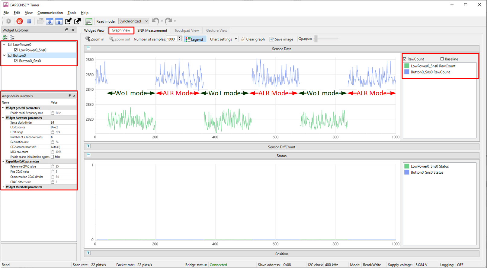
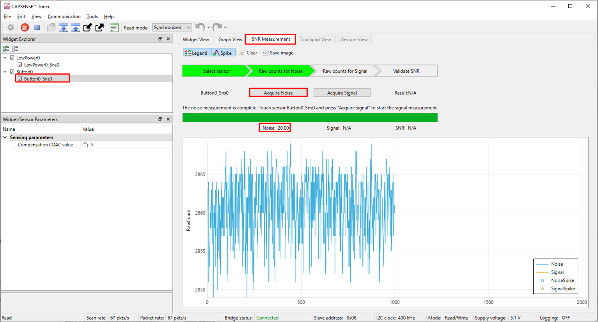
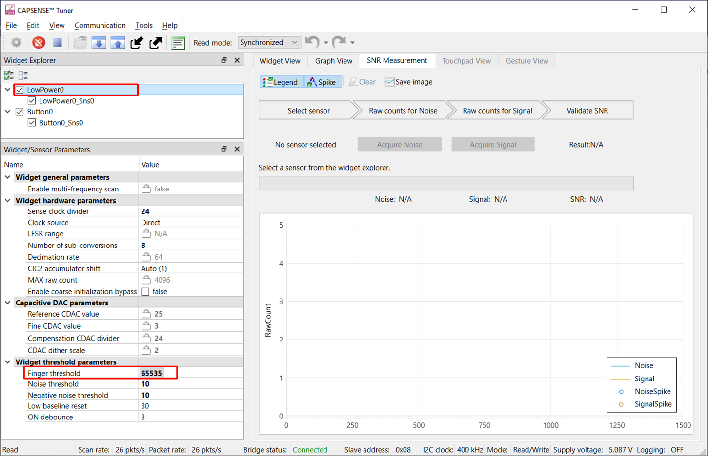
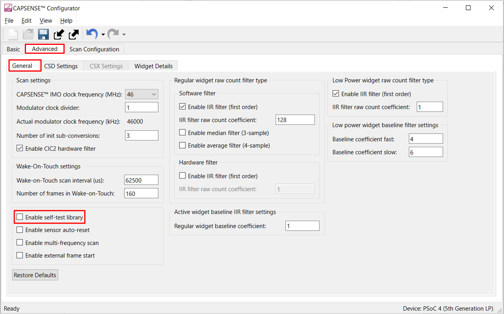
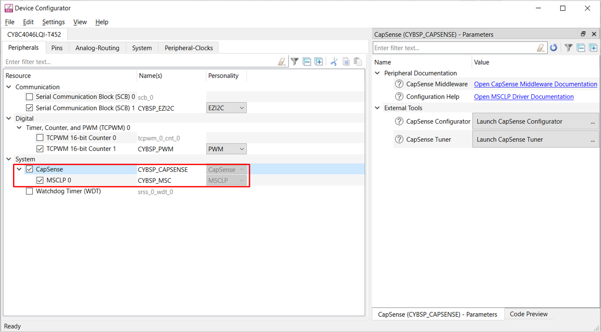
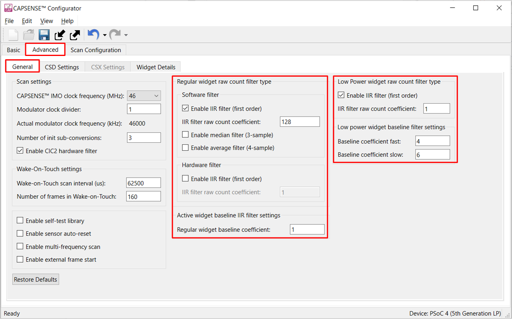
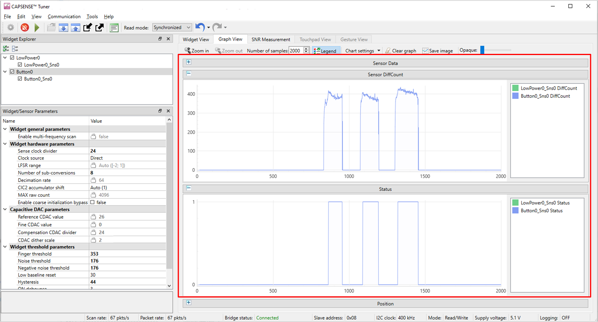
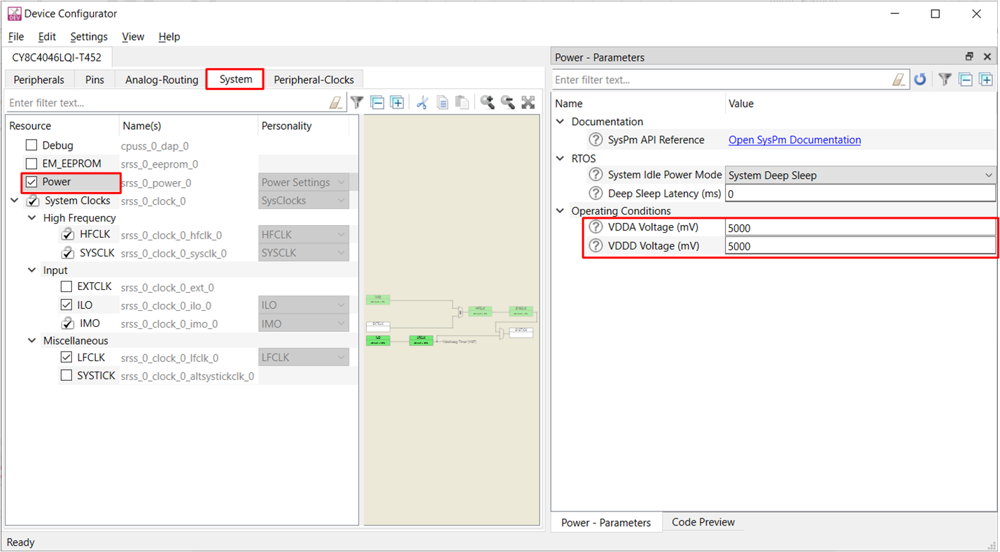
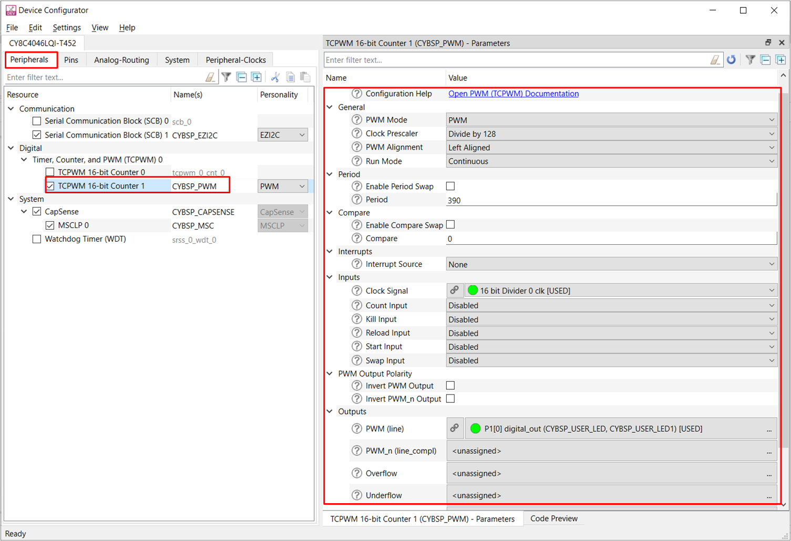

# PSOC&trade; 4: MSCLP low-power self-capacitance button

This code example demonstrates a low-power self-capacitance button application on a PSOC&trade; 4 device with multi-sense converter low-power (MSCLP) CAPSENSE&trade; block. It describes recommended power states and transitions, and the procedure to manually tune the self-capacitance-based low-power widget for optimum performance, with respect to parameters, such as power consumption and response time, using CSD-RM sensing technique, and CAPSENSE&trade; Tuner.

[View this README on GitHub.](https://github.com/Infineon/mtb-example-psoc4-msclp-low-power-csd-button)

[Provide feedback on this code example.](https://cypress.co1.qualtrics.com/jfe/form/SV_1NTns53sK2yiljn?Q_EED=eyJVbmlxdWUgRG9jIElkIjoiQ0UyMzg4ODYiLCJTcGVjIE51bWJlciI6IjAwMi0zODg4NiIsIkRvYyBUaXRsZSI6IlBTT0MmdHJhZGU7IDQ6IE1TQ0xQIGxvdy1wb3dlciBzZWxmLWNhcGFjaXRhbmNlIGJ1dHRvbiIsInJpZCI6Imx1Y2t5IiwiRG9jIHZlcnNpb24iOiI0LjAuMCIsIkRvYyBMYW5ndWFnZSI6IkVuZ2xpc2giLCJEb2MgRGl2aXNpb24iOiJNQ0QiLCJEb2MgQlUiOiJJQ1ciLCJEb2MgRmFtaWx5IjoiUFNPQyJ9)


## Requirements

- [ModusToolbox&trade;](https://www.infineon.com/modustoolbox) v3.5 or later

   > **Note:** This code example requires ModusToolbox&trade; v3.5 and is not backward compatible with older versions.

- Board support package (BSP) minimum required version: 3.3.0
- Programming language: C
- Associated parts: [PSOC&trade; 4000T](https://www.infineon.com/002-33949), [PSOC&trade; 4100T Plus](https://www.infineon.com/002-39671)


## Supported toolchains (make variable 'TOOLCHAIN')

- GNU Arm&reg; Embedded Compiler v11.3.1 (`GCC_ARM`) – Default value of `TOOLCHAIN`
- Arm&reg; Compiler v6.22 (`ARM`)
- IAR C/C++ Compiler v9.50.2 (`IAR`)


## Supported kits (make variable 'TARGET')

- [PSOC&trade; 4000T CAPSENSE&trade; Prototyping Kit](https://www.infineon.com/CY8CPROTO-040T) (`CY8CPROTO-040T`) – Default value of `TARGET`
- [PSOC&trade; 4100T Plus CAPSENSE&trade; Prototyping Kit](https://www.infineon.com/CY8CPROTO-041TP) (`CY8CPROTO-041TP`)


## Hardware setup

This example uses the board's default configuration. See the kit user guide to configure the hardware to operate at the required operating voltage. To setup the device VDDA supply voltage, see Section [Set up the VDDA supply voltage and debug mode in Device Configurator](#set-up-the-vdda-supply-voltage-and-debug-mode-in-device-configurator).

This application is tuned to perform optimally at the default voltage. However, you can observe the basic functionality at other supported voltages.

**Table 1. Kit user guide and supported voltages**

Kit | User guide  | 1.8 V | 3.3 V | 5 V
:-------- |:----------- |:----------- |:----- |:-----
CY8CPROTO-040T| [CY8CPROTO-040T PSOC&trade; 4000T CAPSENSE&trade; Prototyping Kit guide](https://www.infineon.com/002-38600)  | Yes | Yes | Yes*
CY8CPROTO-041TP| [CY8CPROTO-041TP PSOC&trade; 4100T Plus CAPSENSE&trade; Prototyping Kit guide](https://www.infineon.com/002-40273) | Yes | Yes | Yes*

<br>

Yes* - Kit default operating voltage.


## Software setup

See the [ModusToolbox&trade; tools package installation guide](https://www.infineon.com/ModusToolboxInstallguide) for information about installing and configuring the tools package.

This example requires no additional software or tools.


## Using the code example


### Create the project

The ModusToolbox&trade; tools package provides the Project Creator as both a GUI tool and a command line tool.

<details><summary><b>Use Project Creator GUI</b></summary>

1. Open the Project Creator GUI tool

   There are several ways to do this, including launching it from the dashboard or from inside the Eclipse IDE. For more details, see the [Project Creator user guide](https://www.infineon.com/ModusToolboxProjectCreator) (locally available at *{ModusToolbox&trade; install directory}/tools_{version}/project-creator/docs/project-creator.pdf*)

2. On the **Choose Board Support Package (BSP)** page, select a kit supported by this code example. See [Supported kits](#supported-kits-make-variable-target)

   > **Note:** To use this code example for a kit not listed here, you may need to update the source files. If the kit does not have the required resources, the application may not work

3. On the **Select Application** page:

   a. Select the **Applications(s) Root Path** and the **Target IDE**

      > **Note:** Depending on how you open the Project Creator tool, these fields may be pre-selected for you

   b. Select this code example from the list by enabling its check box

      > **Note:** You can narrow the list of displayed examples by typing in the filter box

   c. (Optional) Change the suggested **New Application Name** and **New BSP Name**

   d. Click **Create** to complete the application creation process

</details>


<details><summary><b>Use Project Creator CLI</b></summary>

The 'project-creator-cli' tool can be used to create applications from a CLI terminal or from within batch files or shell scripts. This tool is available in the *{ModusToolbox&trade; install directory}/tools_{version}/project-creator/* directory.

Use a CLI terminal to invoke the 'project-creator-cli' tool. On Windows, use the command-line 'modus-shell' program provided in the ModusToolbox&trade; installation instead of a standard Windows command-line application. This shell provides access to all ModusToolbox&trade; tools. You can access it by typing "modus-shell" in the search box in the Windows menu. In Linux and macOS, you can use any terminal application.

The following example clones the "mtb-example-psoc4-msclp-low-power-csd-button" application with the desired name "MSCLPSelfCapButtonTuning" configured for the *CY8CPROTO-040T* BSP into the specified working directory, *C:/mtb_projects*:

   ```
   project-creator-cli --board-id CY8CPROTO-040T --app-id mtb-example-psoc4-msclp-low-power-csd-button --user-app-name MSCLPSelfCapButtonTuning --target-dir "C:/mtb_projects"
   ```

The 'project-creator-cli' tool has the following arguments:

Argument | Description | Required/optional
---------|-------------|-----------
`--board-id` | Defined in the <id> field of the [BSP](https://github.com/Infineon?q=bsp-manifest&type=&language=&sort=) manifest | Required
`--app-id`   | Defined in the <id> field of the [CE](https://github.com/Infineon?q=ce-manifest&type=&language=&sort=) manifest | Required
`--target-dir`| Specify the directory in which the application is to be created if you prefer not to use the default current working directory | Optional
`--user-app-name`| Specify the name of the application if you prefer to have a name other than the example's default name | Optional

<br>

> **Note:** The project-creator-cli tool uses the `git clone` and `make getlibs` commands to fetch the repository and import the required libraries. For details, see the "Project creator tools" section of the [ModusToolbox&trade; tools package user guide](https://www.infineon.com/ModusToolboxUserGuide) (locally available at {ModusToolbox&trade; install directory}/docs_{version}/mtb_user_guide.pdf).

</details>


### Open the project

After the project has been created, you can open it in your preferred development environment.


<details><summary><b>Eclipse IDE</b></summary>

If you opened the Project Creator tool from the included Eclipse IDE, the project will open in Eclipse automatically.

For more details, see the [Eclipse IDE for ModusToolbox&trade; user guide](https://www.infineon.com/MTBEclipseIDEUserGuide) (locally available at *{ModusToolbox&trade; install directory}/docs_{version}/mt_ide_user_guide.pdf*).

</details>


<details><summary><b>Visual Studio (VS) Code</b></summary>

Launch VS Code manually, and then open the generated *{project-name}.code-workspace* file located in the project directory.

For more details, see the [Visual Studio Code for ModusToolbox&trade; user guide](https://www.infineon.com/MTBVSCodeUserGuide) (locally available at *{ModusToolbox&trade; install directory}/docs_{version}/mt_vscode_user_guide.pdf*).

</details>


<details><summary><b>Arm&reg; Keil&reg; µVision&reg;</b></summary>

Double-click the generated *{project-name}.cprj* file to launch the Keil&reg; µVision&reg; IDE.

For more details, see the [Arm&reg; Keil&reg; µVision&reg; for ModusToolbox&trade; user guide](https://www.infineon.com/MTBuVisionUserGuide) (locally available at *{ModusToolbox&trade; install directory}/docs_{version}/mt_uvision_user_guide.pdf*).

</details>


<details><summary><b>IAR Embedded Workbench</b></summary>

Open IAR Embedded Workbench manually, and create a new project. Then select the generated *{project-name}.ipcf* file located in the project directory.

For more details, see the [IAR Embedded Workbench for ModusToolbox&trade; user guide](https://www.infineon.com/MTBIARUserGuide) (locally available at *{ModusToolbox&trade; install directory}/docs_{version}/mt_iar_user_guide.pdf*).

</details>


<details><summary><b>Command line</b></summary>

If you prefer to use the CLI, open the appropriate terminal, and navigate to the project directory. On Windows, use the command-line 'modus-shell' program; on Linux and macOS, you can use any terminal application. From there, you can run various `make` commands.

For more details, see the [ModusToolbox&trade; tools package user guide](https://www.infineon.com/ModusToolboxUserGuide) (locally available at *{ModusToolbox&trade; install directory}/docs_{version}/mtb_user_guide.pdf*).

</details>


## Operation


1. Connect the board to your PC using the USB cable through the KitProg3 USB connector

2. Program the board using one of the following:

   <details><summary><b>Using Eclipse IDE</b></summary>

      1. Select the application project in the Project Explorer

      2. In the **Quick Panel**, scroll down, and click **\<Application Name> Program (KitProg3_MiniProg4)**
   </details>


   <details><summary><b>In other IDEs</b></summary>

   Follow the instructions in your preferred IDE.

   </details>


   <details><summary><b>Using CLI</b></summary>

     From the terminal, execute the `make program` command to build and program the application using the default toolchain to the default target. The default toolchain is specified in the application's Makefile but you can override this value manually:
      ```
      make program TOOLCHAIN=<toolchain>
      ```

      Example:
      ```
      make program TOOLCHAIN=GCC_ARM
      ```
   </details>

3. After programming, the application starts automatically
     
   > **Note:** After programming, you may see the following error message if debug mode is disabled, see **Table 16** for the default debug configuration in the supported kits. Ignore the error or enable the debug mode to solve this error

   ``` c
   "Error: Error connecting Dp: Cannot read IDR"
   ```

4. To test the application, observe the power mode LED state change depending on the different low-power states based on the user interaction. Place your finger over the CAPSENSE&trade; button and notice that LED turns ON when touched, and turns OFF when the finger is lifted. For LED numbers, see **Table 3**

   **Table 2. LED state for different application power modes**

   Power mode  | LED state 
   :---------------------| :-----
   Active  | Blinks at a fast rate 
   Active low-refresh rate (ALR)  | Blinks at a medium rate
   Wake-on-touch (WoT) | Blinks at a slow rate

   <br>

   **Table 3. LED indications**

   Scenario  | CY8CPROTO-040T | CY8CPROTO-041TP 
   :------------------| :-----| :-----
   Touch  | LED3 | LED3 
   Power mode  | LED2 | LED2 
   
   <br> 

5. Verify that the application is transitioning to different power modes based on the user input conditions as follows:

   - If there is no user activity for a certain time (ACTIVE_MODE_TIMEOUT_SEC = 10 s), the application transitions to ALR mode and the refresh rate is reduced to 32 Hz
   
   - Further non-activity for a certain time (ALR_MODE_TIMEOUT_SEC = 5 s) transitions the application to the lowest-power mode – the wake-on-touch mode, which scans the low-power widget at a low refresh rate (16 Hz)

   **Figure 1. Low-power mode state machine**

   


### Monitor data using the Tuner application

1. Open the CAPSENSE&trade; Tuner from the **BSP Configurator** section in the IDE **Quick Panel**

   You can also run the CAPSENSE&trade; Tuner application standalone from *{ModusToolbox&trade; install directory}/ModusToolbox/tools_{version}/capsense-configurator/capsense-tuner*. In this case, after opening the application, select **File** > **Open** and open the *design.cycapsense* file of the respective application, which is present in the *{Application root directory}/bsps/TARGET_APP_\<BSP-NAME>/config* folder

   See [ModusToolbox&trade; user guide](https://www.infineon.com/ModusToolboxUserGuide) (locally available at {*ModusToolbox install directory}/docs_{version}/mtb_user_guide.pdf*) for options to open the CAPSENSE&trade; Tuner application using the CLI for more information

2. Ensure that the status LED is ON and not blinking. This indicates that the onboard KitProg3 is in CMSIS-DAP Bulk mode. See [Firmware-loader](https://github.com/Infineon/Firmware-loader) to update the firmware and switch modes in KitProg3

3. In the Tuner application, click on the **Tuner Communication Setup** icon or select **Tools** > **Tuner Communication Setup**. In the window, select the I2C checkbox under KitProg3 and configure it as follows:

   - **I2C address:** 8
   - **Sub-address:** 2 Bytes
   - **Speed (kHz):** 400

   These are the same values set in the EZI2C resource.

   **Figure 2. Tuner Communication Setup parameters**

   
   
   <br>

4. Click **Connect** or select **Communication** > **Connect** to establish a connection

   **Figure 3. Establish connection**

   
   
   <br>

5. Click **Start** or select **Communication** > **Start** to start data streaming from the device

   **Figure 4. Start tuner communication**

   
   
   <br>
   
   The **Widget/Sensor Parameters** tab is updated with the parameters configured in the **CAPSENSE&trade; Configurator** window. The tuner displays the data from the sensor in the **Widget View** and **Graph View** tabs

6. Set the **Read mode** to **Synchronized mode**. Navigate to the **Widget View** tab and notice that the **Button0** widget is highlighted in **blue** when you touch it

   **Figure 5. Widget view of the CAPSENSE&trade; Tuner**

   
   
   <br>

7. Go to the **Graph View** tab to view the raw count, baseline, difference count, and status for each sensor. Observe that the low-power widget sensor (**LowPower0_Sns0**) raw count is plotted once the device completes the full frame scan (or detects a touch) in **Wake-on-touch/WoT** mode and moved to **Active/ALR** mode

   **Figure 6. Graph view of the CAPSENSE&trade; Tuner**

   
   
   <br>

8. See **Widget/Sensor parameters** section in the CAPSENSE&trade; Tuner window as shown in **Figure 6**

9. Switch to the **SNR Measurement** tab for measuring the SNR and verify that the SNR is greater than 5:1, and the signal count is above 50; select **Button0** and **Button0_Sns0** sensor, and then click **Acquire noise** as shown in **Figure 7**

   **Figure 7. CAPSENSE&trade; Tuner - SNR measurement: Acquire noise**

   
    
   <br>

   > **Note:** Because the scan refresh rate is lower in **ALR** and **WoT** mode, it takes more time to acquire noise. Touch the CAPSENSE&trade; button before clicking **Acquire noise** to transition the device to Active mode to receive the signal faster
    
   <br>

10. Once the noise is acquired, place the finger at a position on the button and then click **Acquire signal**. Ensure that the finger remains on the button as long as the signal acquisition is in progress. Observe that the SNR is greater than 5:1 and the signal count is above '50'

    The calculated SNR on this button is displayed, as shown in **Figure 8**. Based on the end system design, test the signal with a finger that matches the size of normal use case. Also, test using smaller size that will be rejected by the system to ensure that they do not reach the finger threshold

    **Figure 8. CAPSENSE&trade; Tuner - SNR measurement: Acquire signal**

    
    
    <br>
    
11. To measure the SNR of the low-power sensor (**LowPower0_Sns0**), set the **Finger threshold** to max (65535) in **Widget/Sensor Parameters** as shown in **Figure 9** for both **Button0** and **LowPower0** widgets. This is required to stop detecting a touch in low-power and ALR modes and avoid state transitions to Active mode from both low-power and ALR modes.
Use the **Apply to Device** option to set the modified parameters to the device instantaneously. But make the final configuration using the CAPSENSE&trade; Configurator

    **Figure 9. CAPSENSE&trade; - Update finger threshold**

    

    **Figure 10. Apply changes to device**

    

    <br>

12. Repeat steps 10 and 11 to observe the SNR and signal count as shown in **Figure 11**

    **Figure 11. CAPSENSE&trade; Tuner - SNR measurement: Low-power widget**

    

    <br>

    > **Note:** A 6 mm metal finger is used in this example for tuning


## Measure current at different power modes

1. Disable the run time measurement, PWM LED, and tuner macros to measure the current used for CAPSENSE&trade; sensing in each power mode in *main.c* and disable the self-test library from the CAPSENSE&trade; Configurator as follows:

      ```
      #define ENABLE_RUN_TIME_MEASUREMENT      (0u)
      
      #define ENABLE_PWM_LED                   (0u)

      #define ENABLE_TUNER                     (0u)
      ```
   
   <br>

2. Disable the self-test library from the CAPSENSE&trade; Configurator as follows:

   **Figure 12. Disable self-test library**

   
   
   <br>

3. Disable the debug mode if enabled. By default, it is disabled. To enable, see the [setup the VDDA supply voltage and Debug mode](#set-up-the-vdda-supply-voltage-and-debug-mode-in-device-configurator) section. Enabling the debug mode keeps the SWD pins active in all device power modes and even during Deep Sleep. This leads to higher power consumption

4. Connect the kit to a power analyzer (KEYSIGHT - N6705C), using a current measurement header to evaluate the low-power feature of the device, as shown in **Figure 13**. For current measurement header of the kit, see **Table 4**

   **Figure 13. Power analyzer connection**

   

   <br>

   **Table 4. Header indication for current measurement**

   Kit             | CY8CPROTO-040T | CY8CPROTO-041TP
   :-------------- | :-------------: | :-------------: 
   Header          |       J2        |       J2        

   <br> 

5. Control the power analyzer device through the laptop using a software tool called "Keysight BenchVue Advanced Power Control and Analysis"

6. Select the current measurement option from the **Instrument Control** setup. Then, select and turn ON the output channel, as shown in **Figure 14**

   **Figure 14. Current measurement setup**

   

   <br>

7. Capture the data using the data log option from the tool. The average current consumption is measured using cursors on each power mode, as shown in **Figure 15**

   **Figure 15. Current measurement**

   
   
   <br>

8. After reset, the application transitions to low-power states if there is no user activity, such as button touch detection, to reduce the power consumption, as shown in **Figure 16**

   **Figure 16. Power mode transition - no user activity**
   
   

   <br>

9. If touch is detected in low-power states, the application transitions to Active mode with the highest refresh rate, as shown in **Figure 17**

   **Figure 17. Power mode transition - touch detection**

   

   <br>

   **Table 5. Measured current for different power modes**

   Power mode  | Refresh rate (Hz) | Current consumption (µA) <br> (CY8CPROTO-040T) | Current consumption (µA) <br> (CY8CPROTO-041TP)
   :---------------------|:-----:|:----: |:----:
   Active  | 128 | 67 | 96
   Active low-refresh rate (ALR)  |  32 | 18 | 26
   Wake-on-touch (WoT) |  16 | 3.1 | 5

   <br>

   **Table 6. Deep Sleep current of different kits**
  
   Parameter | CY8CPROTO-040T (µA)| CY8CPROTO-041TP (µA)
   :-------- |:-----------: |:-----------:
   Deep Sleep |  1.7  |  2.3 
      
   <br>
   
   > **Note:** The WoT current as indicated in **Table 5** is measured on a kit with the Deep Sleep current mentioned in **Table 6**. If the kit has a Deep Sleep current of 2.5 µA (typical), the WoT current is expected to be higher


## Tuning procedure

<details><summary><b>Create a custom BSP for your board</b></summary>

1. Create a custom BSP for your board having any device, by following the steps given in the [ModusToolbox&trade; BSP Assistant user guide](https://www.infineon.com/ModusToolboxBSPAssistant)

2. Open the *design.modus* file from *{Application root directory}/bsps/TARGET_APP_\<BSP-NAME>/config* folder obtained in the previous step and enable CAPSENSE&trade; to get the *design.cycapsense* file. CAPSENSE&trade; configuration can then be started from scratch as follows
</details>

<br>

> **Note:** See the section "Selecting CAPSENSE&trade; hardware parameters" in [AN85951 PSOC&trade; 4 and PSOC&trade; 6 MCU CAPSENSE&trade; design guide](https://www.infineon.com/AN85951) to learn about the considerations for selecting each parameter value. In addition, see the "Low-power widget parameters" section in [AN234231 - PSOC&trade; 4 CAPSENSE&trade; ultra-low-power capacitive sensing techniques](https://www.infineon.com/AN234231) to learn about the considerations for parameter values specific to low-power widgets.


**Figure 18. Low-power widget tuning flow**


Do the following to tune the button widget:

- [Stage 1: Set the initial hardware parameters](#stage-1-set-the-initial-hardware-parameters)

- [Stage 2: Set the sense clock frequency](#stage-2-set-the-sense-clock-frequency)

- [Stage 3: Measure sensor capacitance to set CDAC tuning mode](#stage-3-measure-sensor-capacitance-to-set-cdac-tuning-mode)

- [Stage 4: Fine tune for the required SNR, power, and refresh rate](#stage-4-fine-tune-for-required-snr-power-and-refresh-rate)

- [Stage 5: Tune the threshold parameters](#stage-5-tune-threshold-parameters)


### Stage 1: Set the initial hardware parameters

1. Connect the board to the PC using the USB cable through the KitProg3 USB connector

2. Launch the **Device Configurator** tool

   Launch the Device Configurator in Eclipse IDE for ModusToolbox&trade; from the Tools section in the IDE Quick Panel or Standalone mode from the *{ModusToolbox&trade; install directory}/ModusToolbox/tools_{version}/device-configurator/device-configurator*. In this case, after opening the application, select **File** > **Open** and open the *design.modus* file of the respective application, which is present in the *{Application root directory}/bsps/TARGET_APP_\<BSP-NAME>/config* folder

3. Enable the CAPSENSE&trade; channel in **Device Configurator** as shown in **Figure 19** and save the changes

   **Figure 19. Enable CAPSENSE&trade; in Device Configurator**

   

  <br>

4. Launch the **CAPSENSE&trade; Configurator** tool

   You can launch the Configurator tool in Eclipse IDE for ModusToolbox&trade; from the CAPSENSE&trade; peripheral setting in the Device Configurator or directly from the **Tools** section in the **IDE Quick Panel**

   The tool is launched in a standalone mode from *{ModusToolbox&trade; install directory}/ModusToolbox/tools_{version}/capsense-configurator/capsense-configurator*. In this case, after opening the application, select **File** > **Open** and open the *design.cycapsense* file of the respective application, which is present in the *{Application root directory}/bsps/TARGET_APP_\<BSP-NAME>/config* folder

   See the [ModusToolbox&trade; CAPSENSE&trade; Configurator user guide](https://www.infineon.com/ModusToolboxCapSenseConfig) for step-by-step instructions to configure and launch CAPSENSE&trade; in ModusToolbox&trade;

5. In the **Basic** tab, configure a button widget **Button0** and a low-power widget **LowPower0** as a CSD-RM (self-cap) and set the **tuning mode** as **Manual**

   **Figure 20. CAPSENSE&trade; Configurator - Basic tab**

   

   <br>

6. Do the following in the **General** tab under the **Advanced** tab:

   **Table 7. Widget details**

   Parameter | Setting | Comment
   :-------- |:----------- |:-----------
   CAPSENSE&trade; IMO Clock frequency (MHz) | 46 | Frequency of clock used as source for the CAPSENSE&trade; peripheral
   Modulator clock divider | 1 | Set to obtain the optimum modulator clock frequency
   Number of init sub-conversions | 3 | To ensure proper initialization of CAPSENSE&trade; 3 init sub-conversion is required
   Wake-on-Touch scan interval (us) | 62500 | It is set based on the required low-power state scan refresh rate. For example, to get a 16 Hz refresh rate, set the value to 62500
   Number of frames in Wake-on-Touch | 160 | This determines the maximum time that the device will be kept in the lowest-power mode (WoT timeout) if there is no user activity. The maximum time can be calculated using **Equation 1**

   
   **Equation 1**
   
   
   
   <br>
   
   > **Note:** For tuning low-power widgets, the number of frames in Wake-on-Touch must be less than the maximum number of frames. This is calculated using the number of sensors in WoT mode and SRAM size. Exceeding this overwrite the previous raw counts of the frame

   **Table 8. Maximum number of raw counts values in SRAM**

   Number of low power widgets  | Maximum number of raw counts in SRAM
   :---------------------| :-----
   1  | 245
   2  | 117
   3  | 74
   4  | 53
   5  | 40
   6  | 31
   7  | 25
   8  | 21

   <br>
  
   Retain the default settings for all regular and low-power widget filters. To enable or update the filters later depending on the SNR requirements in [Stage 4: Fine tune for required SNR, power, and refresh rate](#stage-4-fine-tune-for-required-snr-power-and-refresh-rate). The filters reduce the peak-to-peak noise, and using software filters results in a higher scan time
      
   **Figure 21. CAPSENSE&trade; Configurator – General settings**

   
   
   <br>

   > **Note:** Each tab has a **Restore Defaults** button to restore the parameters of that tab to their default values

   <br>
    
7. Go to the **CSD Settings** tab and make the following changes:
 
   **Table 9. Scan setting**

   Parameter | CY8CPROTO-040T | CY8CPROTO-041TP | Comment
   :-------- |:----------- |:----------- |:-----------
   Inactive sensor connection | Shield | Shield | Connects the inactive sensors (configured sensors which are not scanned) to the driven shield
   Shield mode | Active | Active |The driven shield is a signal that replicates the sensor-switching signal. It helps reduce sensor parasitic capacitance
   Total shield count | 10 | 3 |  Selects the number of shield electrodes used in the design. Most designs work with one dedicated shield electrode but some designs require multiple dedicated shield electrodes to ease the PCB layout routing or to minimize the PCB area used for the shield layer
   Raw count calibration level (%) | 70 | 85 | If the sensor raw count saturates (equals Max Raw count) on touch, reduce the Raw count calibration level (%). This will prevent raw count saturation

   <br>
   
   **Figure 22. CAPSENSE&trade; Configurator - Advanced CSD Settings**

   
         
   <br>

8. Go to the **Widget Details** tab

   Select **LowPower0** from the left pane and then set the following:

   **Table 10. Initial widget parameter setting**

   Parameter | Setting | Comment
   :-------- |:----------- |:-----------
   Sense clock divider | Default | Value is set in [Stage 2: Set the sense clock frequency](#stage-2-set-the-sense-clock-frequency)
   Clock source | Direct | Direct clock is a constant frequency sense clock source. When you chose this option, the sensor pin switches with a constant frequency
   Number of sub-conversions | 60 | Good starting point to ensure a fast scan time and sufficient signal. This value will be adjusted as required in [Stage 4: Fine-tune for required SNR, power, and refresh rate](#stage-4-fine-tune-for-required-snr-power-and-refresh-rate)
   Finger threshold | 65535 | It is also set to the maximum to avoid the waking up of the device from WoT mode
   Noise threshold |10 | Baseline is not updated when raw count is above baseline + Noise threshold
   Negative noise threshold |10 | Baseline is not updated when raw count is above baseline - Negative noise threshold
   Low baseline reset | 10 | If raw count is lower than the Negative noise threshold for this many samples, baseline is reset to the current raw count
   Hysteresis | 10 | Prevents sensor status toggling due to system noise
   ON debounce | 3 | Number of consecutive scans during which a sensor must be active so that a touch is reported

   Next, select **Button0** from the left pane, and repeat the same configuration for that sensor as well

   **Figure 23. CAPSENSE&trade; Configurator – Widget Details tab**

   
     
   <br>

9. Go to the **Scan Configuration** tab to select the pins and the scan slots. Do the following:

   - Configure pins for the electrodes using the drop down menu

   - Configure the scan slots using the **Auto-assign slots** option. It automatically reassigns all slots for the sensors based on a widget and sensor order

   - Select **Button0_Sns0** as **Ganged** under the **LowPower0** widget as shown in **Figure 24**

   - Check the notice list for warnings or errors

   **Figure 24. Scan configuration tab**

   

   <br>

10. Click **Save** to apply the settings

    See the [CAPSENSE&trade; design guide](https://www.infineon.com/AN85951) for detailed information on tuning parameters.


### Stage 2: Set the sense clock frequency

The sense clock is derived from the modulator clock using a clock-divider and is used to scan the sensor by driving the CAPSENSE&trade; switched capacitor circuits. Both the clock source and clock divider are configurable. The sense clock divider should be configured such that the pulse width of the sense clock is long enough to allow the sensor capacitance to charge and discharge completely. This is verified by observing the charging and discharging waveforms of the sensor using an oscilloscope and an active probe. The sensors should be probed close to the electrode, and not at the sense pins or the series resistor. 

See **Figure 25** and **Figure 26** for waveforms observed on the shield. **Figure 25** shows proper charging when sense clock frequency is correctly tuned. The pulse width is at least 5 Tau, i.e., the voltage is reaching at least 99.3 percent of the required voltage at the end of each phase. **Figure 26** shows incomplete settling (charging/discharging).

**Figure 25. Proper charge cycle of a sensor**


**Figure 26. Improper charge cycle of a sensor**


1. Program the board and launch CAPSENSE&trade; Tuner

2. Observe the charging waveform of the sensor as described earlier 

3. If the charging is incomplete, increase the sense clock divider. This can be done in CAPSENSE&trade; Tuner by selecting the sensor and editing the sense clock divider parameter in the Widget/Sensor Parameters panel

   > **Note:** 
   - The sense clock divider should be divisible by 4. This ensures that all four scan phases have equal durations
   - After editing the value click the **Apply to Device** button and observe the waveform again. Repeat this until complete settling is observed
   - Using a passive probe will add an additional parasitic capacitance of around 15 pF; therefore, it should be considered during tuning
   
4. Click the **Apply to Project** button so that the configuration is saved to your project

   **Figure 27. Sense clock divider setting**

   
   
5. Repeat this process for all the sensors and the shield. Each sensor might require a different sense clock divider value to charge/discharge completely. But all the sensors which are in the same scan slot need to have the same sense clock source, sense clock divider and number of sub-conversions. Therefore, take the largest sense clock divider in a given scan slot and apply it to all the other sensors that share that slot

   **Table 11. Sense clock divider settings obtained for supported kits**

   Parameter | CY8CPROTO-040T| CY8CPROTO-041TP
   :-------- |:----------- |:-----------
   Sense clock divider | 24  | 16 
      
   <br>


### Stage 3: Measure sensor capacitance to set CDAC tuning mode

Generally the CDAC tuning mode is recommended to be set to **Auto**, however the appropriate tuning mode to use has some dependency on the sensor parasitic capacitance (Cp).
 
In order to avoid signal variation across devices in production, PSOC&trade; 4100T Plus devices have CDAC trim codes in SFlash (read-only). This code is used to scale the Reference CDAC and Fine CDAC parameters, which compensates for variations in the CDAC and brings down the overall signal variation across units.

This trimming is applicable only in the following scenarios:
- Only for CSD widgets (Regular and Low power)
- Sensor Cp is less than 4 pF
- Reference CDAC and Fine CDAC are set to **Manual** mode

   > **Note:** Select CDAC tuning mode to **Auto**, if sensor Cp is above 4 pF. Also, for sensing methods other than CSD

1. Measure the sensor Cp using the CAPSENSE&trade; middleware, it provides Built-In Self Test (BIST) APIs to measure the capacitance of sensors configured in the application
   
   - Open CAPSENSE&trade; Configurator from Quick Panel and enable the library. See **Figure 28** 

     **Figure 28. CAPSENSE&trade; Configurator – Enable BIST library**

     
   
   - Middleware API used to measure the capacitance of the CSD widget as follows:
      
       ```c
       /* Measure sensor capacitance of the CSD widgets */
       Cy_CapSense_RunSelfTest(CY_CAPSENSE_BIST_SNS_CAP_MASK, &cy_capsense_context);
       ```
   See [CAPSENSE&trade; library and documents](https://github.com/Infineon/capsense) for more details on BIST
   
   - Open the tuner and check the sensor Cp values. If Cp value is above 4 pF, set all CDAC parameters to **Auto** and proceed tuning, see **Figure 30**. Else proceed with the next steps
   
     > **Note:** It is recommended to disable the BIST library to achieve lower power consumption

     **Figure 29. CAPSENSE&trade; Configurator – Read measured sensor Cp**
   
     

     > **Note:** For this CE, the parasitic capacitance (Cp) is greater than 4 pF, therefore, there is no need to enable CDAC scaling

2. Enabling CDAC scaling and setting manual CDAC values, if the sensor Cp is below 4 pF

   - Open CAPSENSE&trade; Configurator and start by setting all CDAC parameters to **Auto**
   
     **Figure 30. CAPSENSE&trade; Configurator – Set CDAC Auto mode**
   
      
   
   - Flash the device. Run the CAPSENSE&trade; Tuner and click apply to project button. This applies the auto calculated CDAC values to the project configuration
      
     **Figure 31. CAPSENSE&trade; Tuner – Apply CDAC values**

     
   
   - Close and reopen the CAPSENSE&trade; Configurator, and enable CDAC scaling as shown in **Figure 32**
   
     **Figure 32. CAPSENSE&trade; Configurator – Enable CDAC scaling**
   
      

   - Set Manual tuning mode only for **Reference CDAC mode** and **Fine CDAC mode** parameters, see **Figure 33**. You can see the CDAC values observed in Step 3 when CDAC was set to **Auto**
      
     **Figure 33. CAPSENSE&trade; Configurator – Manual CDAC configuration**
   
     

   - Flash the device with updated CAPSENSE&trade; configuration
   
   - Open CAPSENSE&trade; Tuner. Now you can see the scaled parameters after applying CDAC scaling
      
     **Figure 34. CAPSENSE&trade; Configurator – Manual CDAC configuration**
   
     
   
3. Use this as a base CDAC configuration and proceed with tuning
 
   For details about the CDAC trimming, See the section Capacitive DACs scaling in [AN85951 – PSOC&trade; 4 and PSOC&trade; 6 MCU CAPSENSE&trade; design guide](https://www.infineon.com/AN85951)


### Stage 4: Fine-tune for required SNR, power, and refresh rate

The sensor should be tuned to have a minimum SNR of 5:1 and a minimum signal of 50 to ensure reliable operation. The sensitivity can be increased by increasing the number of sub-conversions and noise can be decreased by enabling filters. 

> **Note:** If sensor raw count saturates (equals Max Raw count) on touch, reduce raw count calibration level (%), which helps avoid saturation.

The steps for optimizing these parameters are as follows:

1. Measure the SNR as mentioned in the [Operation](#operation) section

2. If the SNR is less than 5:1, increase the number of sub-conversions. Edit the number of sub-conversions (N<sub>sub</sub>) directly in the **Widget/Sensor parameters** tab of the CAPSENSE&trade; Tuner

   > **Note:** Number of sub-conversion should be greater than or equal to 8

3. Load the parameters to the device and measure SNR as mentioned in Steps 10 and 11 in the [Monitor data using the Tuner application](#monitor-data-using-the-tuner-application) section
   
   Repeat steps 1 to 3 until the following conditions are met:
   - Measured SNR from the previous stage is greater than 5:1
   - Signal count is greater than 50

4. If the system is noisy (> 40% of signal), enable the filters

   This example has the CIC2 filter enabled, which increases the resolution for the same scan time. See [AN234231 - PSOC&trade; 4 CAPSENSE&trade; ultra-low-power capacitive sensing techniques](https://www.infineon.com/AN234231) for detailed information on the CIC2 filter. Whenever CIC2 filter is enabled, it is recommended to enable the IIR filter for optimal noise reduction. Therefore this example has the IIR filter enabled as well

   - Open **CAPSENSE&trade; Configurator** from ModusToolbox&trade; Quick Panel and select the appropriate filter as shown in **Figure 35**

     **Figure 35. Filter settings in CAPSENSE&trade; Configurator**

     

   - Enable the filter based on the type of noise in your system. For filter descriptions, see **Table 12** and [AN85951 – PSOC&trade; 4 and PSOC&trade; 6 MCU CAPSENSE&trade; design guide](https://www.infineon.com/AN85951) for more details

      **Table 12. Filters description**

      Filter   | Description
      :---------------------| :----------------- 
      Median  | Eliminates noise spikes from motors and switching power supplies
      Average  | Eliminates periodic noise (for example, from power supplies)
      First order IIR | Software IIT filter which eliminates high frequency noise, low coefficient results in lower noise but slows down response
      Hardware IIR | Eliminate high frequency noise, low coefficient means lower filtering, while higher response time

      <br>

   - Click **Save** and program the device to update the filter settings

   > **Note:** Increasing the number of sub-conversions and enabling filters will increase the scan time which in turn decreasing the responsiveness of the sensor. Increase in scan time also increases power consumption. Therefore, the number of sub-conversions and filter configuration must be optimized to achieve a balance between SNR, power, and refresh rate


### Stage 5: Tune threshold parameters

Various thresholds relative to the signal need to be set for each sensor. Do the following in CAPSENSE&trade; Tuner to set up the thresholds for a widget:

1. Switch to the **Graph View** tab and select **Button0**

2. Touch the sensor and monitor the touch signal in the **Sensor signal** graph, as shown in **Figure 36**

   **Figure 36. Sensor signal when the sensor is touched**

   

   <br>

3. Note the signal measured for touch. Respective signals observed for supported kits is shown in **Table 14**:

   **Table 13. Measured signal**

   Parameter   | Button0 (CY8CPROTO-040T) | Button0 (CY8CPROTO-041TP)
   :---------------------| :----- | :-----
   Touch signal  | 441 | 94

   **Table 14. Settings for parameters related to touch detection**

   Parameter  |   CY8CPROTO-040T |  CY8CPROTO-041TP | Remark 
   :--------------------| :-----| :-----| :-----
   Finger threshold  | 353  | 75 | 80% of the touch signal
   Noise threshold   | 176| 36 | 40% of the touch signal
   Negative noise threshold   | 176| 36 | 40% of the touch signal
   Low baseline reset  | 30| 30 | 30 (by default)  
   Hysteresis  | 44 | 9 | 10% of the touch signal 
   ON debounce  | 3 | 3 | 3

   **Figure 37. Widget threshold parameters**

   

   <br>

4. For the **LowPower0_Sns0** low-power sensor, first configure the finger threshold to '65535' and wait for the application to enter low-power mode. Since the finger threshold is set to maximum, touching the low-power button will not switch the application to active mode. Repeat step 2 to 3 for the low-power button

5. Click **Apply to Device**

   **Figure 38. Apply settings to the device**

   

   <br>

   After applying the configuration, test the performance by touching the button. If your sensor is tuned correctly, you will observe the touch status go from 0 to 1 in the **Status** panel of the **Graph View** tab, as shown in **Figure 39**. The status of the button is also indicated by the LED in the kit; the LED turns ON when the finger touches the button and turns OFF when the finger is removed

   **Figure 39. Sensor status in CAPSENSE&trade; Tuner**

   

   <br>

6. Click **Apply to Project** as shown in **Figure 40**. Close **CAPSENSE&trade; Tuner** and launch **CAPSENSE&trade; Configurator**. All the changes in the CAPSENSE&trade; Tuner reflects in the **CAPSENSE&trade; Configurator**

   **Figure 40. Apply settings to project**

   

   <br>


### Process time measurement

To set the optimal refresh rate of each power mode, you need to measure the process time of your application.

Follow these steps to measure the process time of the blocks of application code while excluding the scan time:

1. Enable `ENABLE_RUN_TIME_MEASUREMENT` macro in *main.c* file as follows:
      
   ```
   #define ENABLE_RUN_TIME_MEASUREMENT (1u)
   ```     
   This macro enables the system tick configuration and runtime measurement functionalities

2. Place the `start_runtime_measurement()` function call before your application code and the `stop_runtime_measurement()` function call after it. The `stop_runtime_measurement()` function will return the execution time in microseconds (µs)
 
   ```   
      #if ENABLE_RUN_TIME_MEASUREMENT
         uint32_t run_time = 0;
         start_runtime_measurement();
      #endif

      /* User Application Code Start */
      .
      .
      .
      /* User Application Code End */

      #if ENABLE_RUN_TIME_MEASUREMENT
         run_time = stop_runtime_measurement();
      #endif
   ```

3. Run the application in Debug mode with breakpoints placed at the `active_processing_time` and `alr_processing_time` variables as follows:
   ```
      #if ENABLE_RUN_TIME_MEASUREMENT
         active_processing_time=stop_runtime_measurement();
      #endif
      and 
      #if ENABLE_RUN_TIME_MEASUREMENT
         alr_processing_time=stop_runtime_measurement();
      #endif
   ``` 
4. Read the variables by adding them into the **Expressions view** tab

5. Update related macros with the above measured processing times in *main.c* file as follows:
   ```
   #define ACTIVE_MODE_PROCESS_TIME     (xx)

   #define ALR_MODE_PROCESS_TIME        (xx)
   ```


### Scan time measurement

The scan time is also required for calculating the refresh rate of the application power modes. The total scan time of all the widgets in this code example is 16 µs.

It can be calculated as follows:

   - The scan time includes the MSCLP initialization time, Cmod, and the total sub-conversions of the sensor

   - To control the Cmod initialization sequence, set the **Enable coarse initialization bypass** configurator option as listed in the following table:

   **Table 15. Enable coarse initialization bypass**

   Enable coarse initialization bypass | Behavior
   :-------------|:---------
   TRUE| Cmod initialization happens only once before scanning the sensors of the widget
   FALSE| Cmod initialization happens before scanning each sensor of the widget

Use the following equations to measure the widgets scan time based on coarse initialization bypass options selected: 

- **Equation 2. Scan time calculation of a widget with coarse initialization bypass enabled**

  

- **Equation 3. Scan time calculation of a widget with coarse initialization bypass disabled**

  

   Where,

   $n$ = Total number of sensors in the widget

   $N_{init}$ = Number of init sub-conversions

   $N_{sub}$ = Number of sub-conversions

   $SnsClkDiv$ = Sense clock divider

   $F_{mod}$ = Modulator clock frequency

   $k$ = Measured initialization time (MSCLP+Cmod)

   This value of $k$ measured for this application is ~10 µs. It remains constant for all widgets. 

The value of $k$ can be measured using an oscilloscope as shown in **Figure 41**.

 **Figure 41. $k$ value measurement**

   

Update the following macros in *main.c* file using the scan time calculated. The value remains the same for both macros for this application.

```
#define ACTIVE_MODE_FRAME_SCAN_TIME     (xx)

#define ALR_MODE_FRAME_SCAN_TIME        (xx)
```

> **Note:** If the application has more than one widget, add the scan times of individual widgets calculated.


## Debugging

You can debug the example to step through the code.


<details><summary><b>In Eclipse IDE</b></summary>

Use the **\<Application Name> Debug (KitProg3_MiniProg4)** configuration in the **Quick Panel**. For details, see the "Program and debug" section in the [Eclipse IDE for ModusToolbox&trade; user guide](https://www.infineon.com/MTBEclipseIDEUserGuide).

</details>


<details><summary><b>In other IDEs</b></summary>

Follow the instructions in your preferred IDE.

</details>

To enable the debug option, see the [Setup VDDA and Debug mode](#set-up-the-vdda-supply-voltage-and-debug-mode-in-device-configurator) section. To achieve lower power consumption, it is recommended to disable it when not debugging.

See **Table 16** for the default debug configuration in the supported kits.

**Table 16. Debug mode option status**

Kit  | Debug mode 
:----| :----------
CY8CPROTO-040T | Disabled
CY8CPROTO-041TP | Enabled

   
## Design and implementation

The project contains one button configured as a regular and low-power widget in CSD-RM sensing mode. See the [Tuning procedure](#tuning-procedure) section for step-by-step instructions to configure other settings of the **CAPSENSE&trade; Configurator**.

There are two user LEDs used in this project. Touch LED shows the button touch status: it turns ON when touched and turns OFF when the finger is lifted. Power LED shows the current low-power state of the application. See the following table for the LED response-based on the low-power state and for the LED numbers, see **Table 3** in [Operation](#operation) section.

**Table 17. LED state for different application power modes**

Power mode  | LED state
:---------------------| :-----
Active  | Blinks at a fast rate
Active low-refresh rate (ALR)  | Blinks at a medium rate
Wake-on-touch (WoT) | Blinks at a slow rate

There are three power states defined for this project:

- Active mode

- Active low-refresh rate mode

- Wake-on-touch mode

After reset, the device is in active mode, and scans the regular CAPSENSE&trade; widgets with a high refresh rate (128 Hz). If user activity is detected in any other mode, the device is transferred to Active mode to provide the best user interface experience. This mode has the highest power consumption; therefore, your design should reduce the time spent in Active mode as much as possible.

If there is no user activity for a certain time (`ACTIVE_MODE_TIMEOUT_SEC` = 10 s), the application transitions to ALR mode. Here, the refresh rate is reduced to 32 Hz; this mode acts as an intermediate state before moving to the lowest-power mode (WoT mode). This mode can also be used for periodically updating baselines of sensors while there is no user activity for a long time.

Further non-activity for a certain time (`ALR_MODE_TIMEOUT_SEC` = 5 s) transitions the application to the lowest-power mode, Wake-on-touch, which scans the low-power widget at a low refresh rate (16 Hz) and processes the results without CPU intervention.

> **Note:** An internal low-power timer (MSCLP timer) is available in CAPSENSE&trade; MSCLP hardware to set the refresh rate for each power mode as follows:
- For ACTIVE and ALR modes: Use the `Cy_CapSense_ConfigureMsclpTimer()` function
- For WoT mode: Use the Wake-on-Touch scan interval in CAPSENSE&trade; Configurator

The different power modes and transition conditions for a typical use case are as follows:

**Figure 42. State machine showing different power states of the device**


   
<br>

The project uses the [CAPSENSE&trade; middleware](https://github.com/Infineon/capsense) (see ModusToolbox&trade; user guide for more details on selecting a middleware). See [AN85951 – PSOC&trade; 4 and PSOC&trade; 6 MCU CAPSENSE&trade; design guide](https://www.infineon.com/AN85951) for more details on CAPSENSE&trade; features and usage.

The [ModusToolbox&trade;](https://www.infineon.com/modustoolbox) provides a GUI-based tuner application for debugging and tuning the CAPSENSE&trade; system. The CAPSENSE&trade; Tuner application works with EZI2C and UART communication interfaces. This project has an SCB block configured in EZI2C mode to establish communication with the onboard KitProg, which in turn enables reading the CAPSENSE&trade; raw data by the CAPSENSE&trade; Tuner. See [EZI2C Peripheral settings](#resources-and-settings).

The CAPSENSE&trade; data structure that contains the CAPSENSE&trade; raw data is exposed to the CAPSENSE&trade; Tuner by setting up the I2C communication data buffer with the CAPSENSE&trade; data structure. This enables the tuner to access the CAPSENSE&trade; raw data for tuning and debugging CAPSENSE&trade;.


### Set up the VDDA supply voltage and Debug mode in Device Configurator

1. Open **Device Configurator** from the **Quick Panel**

2. Go to the **System** tab. Select the **Power** resource, and set the VDDA value under **Operating conditions** as follows:

   **Figure 43. Setting the VDDA supply in System tab of Device Configurator**

   

   <br>

3. By default, the Debug mode is disabled for this application to reduce power consumption. Enable the Debug mode to enable the SWD pins as follows:

   **Figure 44. Enable Debug mode in the System tab of Device Configurator**

   

   <br>


### Resources and settings

**Figure 45. EZI2C settings**


<br>

**Figure 46. PWM settings**



<br>

**Table 18. Application resources**

 Resource  |  Alias/object     |    Purpose
 :------- | :------------    | :------------
 SCB (I2C) (PDL) | CYBSP_EZI2C          | EZI2C slave driver to communicate with CAPSENSE&trade; Tuner
 TCPWM| CYBSP_PWM          | To show the power mode states
 CAPSENSE&trade; | CYBSP_MSC | CAPSENSE&trade; driver to interact with the MSC hardware and interface the CAPSENSE&trade; sensors
 Digital pin | CYBSP_USER_LED2, CYBSP_USER_LED3 | To show the power states with LED 

<br>

## Firmware flow

**Figure 47. Firmware flowchart**


<br>


## Related resources

Resources  | Links
-----------|----------------------------------
Application notes  | [AN79953](https://www.infineon.com/AN79953) – Getting started with PSOC&trade; 4 MCU <br>  [AN85951](https://www.infineon.com/AN85951) – PSOC&trade; 4 and PSOC&trade; 6 MCU CAPSENSE&trade; design guide <br>  [AN234231](https://www.infineon.com/AN234231) – PSOC&trade; 4 CAPSENSE&trade; ultra-low-power capacitive sensing techniques
Code examples  | [Using ModusToolbox&trade;](https://github.com/Infineon/Code-Examples-for-ModusToolbox-Software) on GitHub
Device documentation |  [PSOC&trade; 4 datasheets](https://www.infineon.com/cms/en/search.html?intc=searchkwr-return#!view=downloads&term=psoc%204&doc_group=Data%20Sheet) <br>[PSOC&trade; 4 technical reference manuals](https://www.infineon.com/cms/en/search.html#!term=psoc%204%20technical%20reference%20manual&view=all)
Development kits | Select your kits from the [Evaluation board finder](https://www.infineon.com/cms/en/design-support/finder-selection-tools/product-finder/evaluation-board)
Libraries on GitHub  | [mtb-pdl-cat2](https://github.com/Infineon/mtb-pdl-cat2) –  PSOC&trade; 4 Peripheral Driver Library (PDL)
Middleware on GitHub  | [capsense](https://github.com/Infineon/capsense) – CAPSENSE&trade; library and documents
Tools  | [ModusToolbox&trade;](https://www.infineon.com/modustoolbox) – ModusToolbox&trade; software is a collection of easy-to-use libraries and tools enabling rapid development with Infineon MCUs for applications ranging from wireless and cloud-connected systems, edge AI/ML, embedded sense and control, to wired USB connectivity using PSOC&trade; Industrial/IoT MCUs, AIROC&trade; Wi-Fi and Bluetooth&reg; connectivity devices, XMC&trade; Industrial MCUs, and EZ-USB&trade;/EZ-PD&trade; wired connectivity controllers. ModusToolbox&trade; incorporates a comprehensive set of BSPs, HAL, libraries, configuration tools, and provides support for industry-standard IDEs to fast-track your embedded application development

<br>


## Other resources

Infineon provides a wealth of data at [www.infineon.com](https://www.infineon.com) to help you select the right device, and quickly and effectively integrate it into your design.


## Document history

Document title: *CE238886* – *PSOC&trade; 4: MSCLP low-power self-capacitance button*

 Version | Description of change
 ------- | ---------------------
 1.0.0   | New code example
 2.0.0   | Major update to support ModusToolbox&trade; v3.2 and CAPSENSE&trade; Middleware v5.0. This version is not backward compatible with previous versions of ModusToolbox&trade;
 2.1.0   | Added support for CY8CPROTO-041TP Prototyping Kit
 3.0.0   | Major update to support ModusToolbox&trade; v3.3. This version is not backward compatible with previous versions of ModusToolbox&trade;
 4.0.0   | Major update to support ModusToolbox&trade; v3.5. This version is not backward compatible with previous versions of ModusToolbox&trade;


All referenced product or service names and trademarks are the property of their respective owners.

The Bluetooth&reg; word mark and logos are registered trademarks owned by Bluetooth SIG, Inc., and any use of such marks by Infineon is under license.

PSOC&trade;, formerly known as PSoC&trade;, is a trademark of Infineon Technologies. Any references to PSoC&trade; in this document or others shall be deemed to refer to PSOC&trade;.

---------------------------------------------------------

© Cypress Semiconductor Corporation, 2023-2025. This document is the property of Cypress Semiconductor Corporation, an Infineon Technologies company, and its affiliates ("Cypress").  This document, including any software or firmware included or referenced in this document ("Software"), is owned by Cypress under the intellectual property laws and treaties of the United States and other countries worldwide.  Cypress reserves all rights under such laws and treaties and does not, except as specifically stated in this paragraph, grant any license under its patents, copyrights, trademarks, or other intellectual property rights.  If the Software is not accompanied by a license agreement and you do not otherwise have a written agreement with Cypress governing the use of the Software, then Cypress hereby grants you a personal, non-exclusive, nontransferable license (without the right to sublicense) (1) under its copyright rights in the Software (a) for Software provided in source code form, to modify and reproduce the Software solely for use with Cypress hardware products, only internally within your organization, and (b) to distribute the Software in binary code form externally to end users (either directly or indirectly through resellers and distributors), solely for use on Cypress hardware product units, and (2) under those claims of Cypress's patents that are infringed by the Software (as provided by Cypress, unmodified) to make, use, distribute, and import the Software solely for use with Cypress hardware products.  Any other use, reproduction, modification, translation, or compilation of the Software is prohibited.
<br>
TO THE EXTENT PERMITTED BY APPLICABLE LAW, CYPRESS MAKES NO WARRANTY OF ANY KIND, EXPRESS OR IMPLIED, WITH REGARD TO THIS DOCUMENT OR ANY SOFTWARE OR ACCOMPANYING HARDWARE, INCLUDING, BUT NOT LIMITED TO, THE IMPLIED WARRANTIES OF MERCHANTABILITY AND FITNESS FOR A PARTICULAR PURPOSE.  No computing device can be absolutely secure.  Therefore, despite security measures implemented in Cypress hardware or software products, Cypress shall have no liability arising out of any security breach, such as unauthorized access to or use of a Cypress product. CYPRESS DOES NOT REPRESENT, WARRANT, OR GUARANTEE THAT CYPRESS PRODUCTS, OR SYSTEMS CREATED USING CYPRESS PRODUCTS, WILL BE FREE FROM CORRUPTION, ATTACK, VIRUSES, INTERFERENCE, HACKING, DATA LOSS OR THEFT, OR OTHER SECURITY INTRUSION (collectively, "Security Breach").  Cypress disclaims any liability relating to any Security Breach, and you shall and hereby do release Cypress from any claim, damage, or other liability arising from any Security Breach.  In addition, the products described in these materials may contain design defects or errors known as errata which may cause the product to deviate from published specifications. To the extent permitted by applicable law, Cypress reserves the right to make changes to this document without further notice. Cypress does not assume any liability arising out of the application or use of any product or circuit described in this document. Any information provided in this document, including any sample design information or programming code, is provided only for reference purposes.  It is the responsibility of the user of this document to properly design, program, and test the functionality and safety of any application made of this information and any resulting product.  "High-Risk Device" means any device or system whose failure could cause personal injury, death, or property damage.  Examples of High-Risk Devices are weapons, nuclear installations, surgical implants, and other medical devices.  "Critical Component" means any component of a High-Risk Device whose failure to perform can be reasonably expected to cause, directly or indirectly, the failure of the High-Risk Device, or to affect its safety or effectiveness.  Cypress is not liable, in whole or in part, and you shall and hereby do release Cypress from any claim, damage, or other liability arising from any use of a Cypress product as a Critical Component in a High-Risk Device. You shall indemnify and hold Cypress, including its affiliates, and its directors, officers, employees, agents, distributors, and assigns harmless from and against all claims, costs, damages, and expenses, arising out of any claim, including claims for product liability, personal injury or death, or property damage arising from any use of a Cypress product as a Critical Component in a High-Risk Device. Cypress products are not intended or authorized for use as a Critical Component in any High-Risk Device except to the limited extent that (i) Cypress's published data sheet for the product explicitly states Cypress has qualified the product for use in a specific High-Risk Device, or (ii) Cypress has given you advance written authorization to use the product as a Critical Component in the specific High-Risk Device and you have signed a separate indemnification agreement.
<br>
Cypress, the Cypress logo, and combinations thereof, ModusToolbox, PSoC, CAPSENSE, EZ-USB, F-RAM, and TRAVEO are trademarks or registered trademarks of Cypress or a subsidiary of Cypress in the United States or in other countries. For a more complete list of Cypress trademarks, visit www.infineon.com. Other names and brands may be claimed as property of their respective owners.
