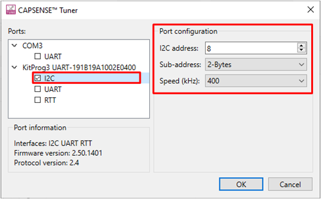
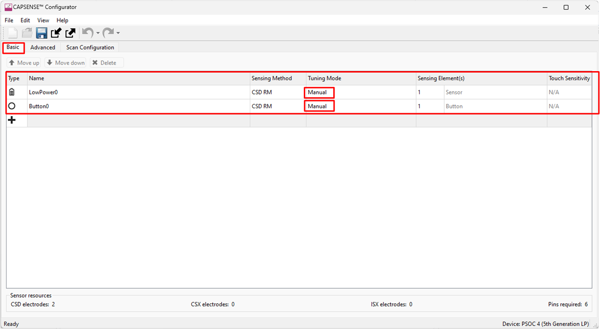
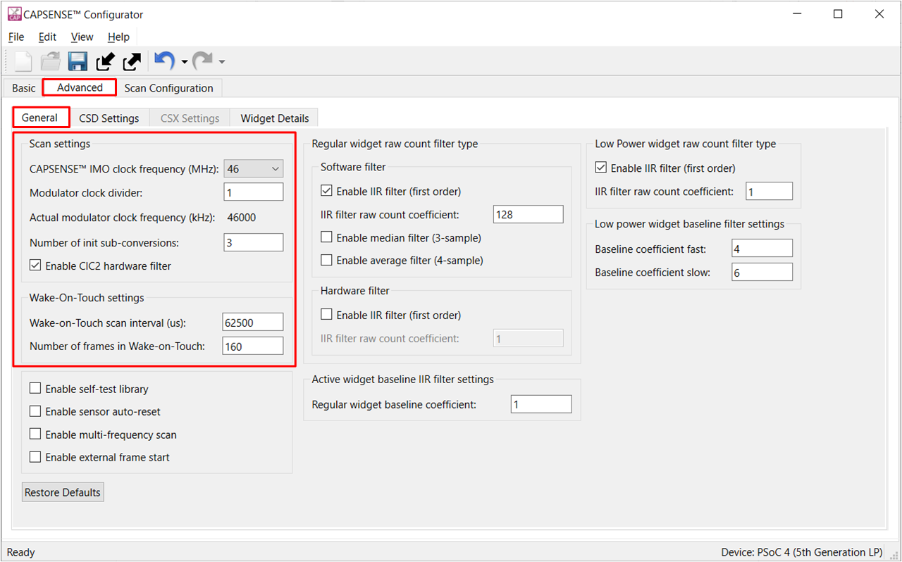
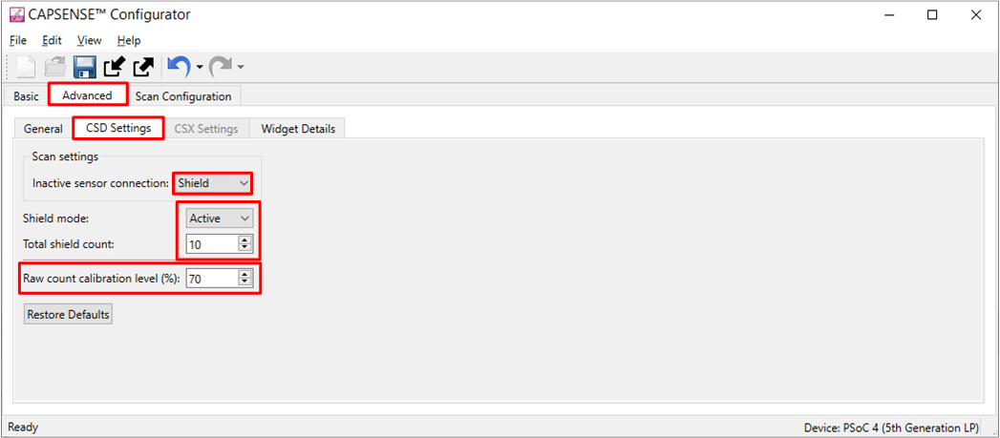
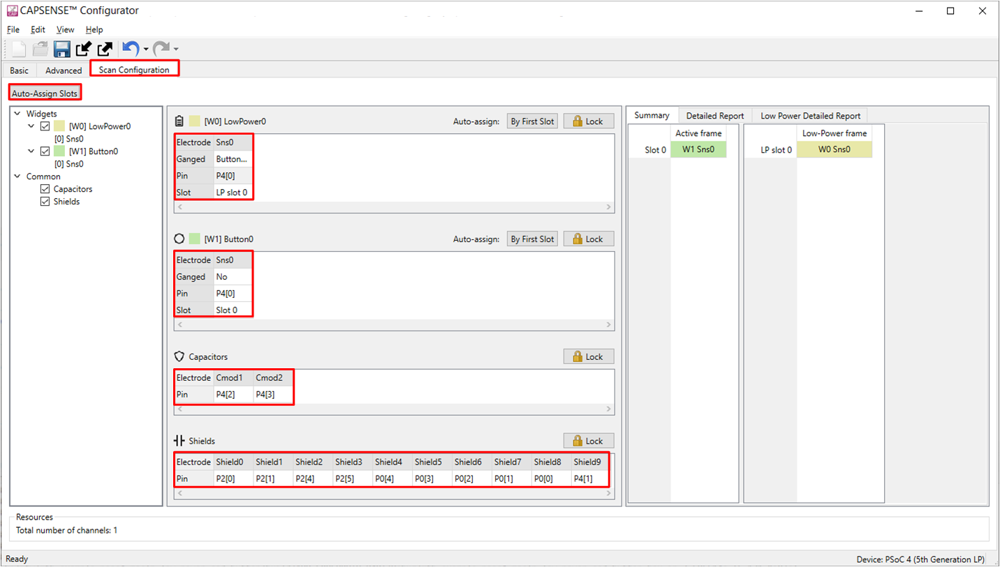
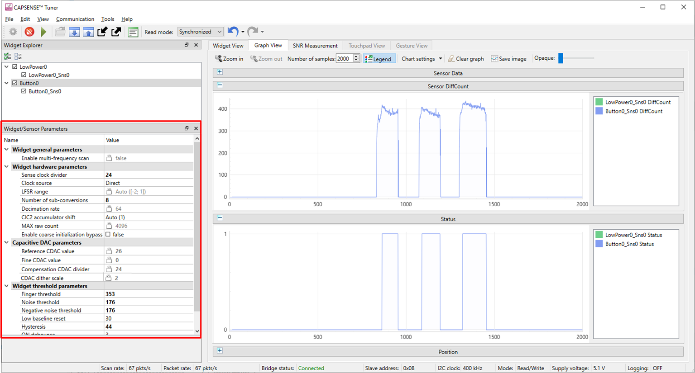

# PSoC&trade; 4: MSCLP low-power CSD button

This code example demonstrates an implementation of a low-power application including recommended power states and transitions, tuning parameter adjustments, and the method of tuning. This example uses a single self-capacitance-based button in multi sense CAPSENSE&trade; low power (MSCLP - 5th generation low-power CAPSENSE&trade;) to demonstrate different considerations to implement a low-power design.

This document also explains to manually tune the self-capacitance-based low-power widget for optimum performance with respect to parameters such as power consumption and response time using the CSD-RM sensing technique and the CAPSENSE&trade; tuner.

[View this README on GitHub.](https://github.com/Infineon/mtb-example-psoc4-msclp-low-power-csd-button)

[Provide feedback on this code example.](https://cypress.co1.qualtrics.com/jfe/form/SV_1NTns53sK2yiljn?Q_EED=eyJVbmlxdWUgRG9jIElkIjoiQ0UyMzg4MTciLCJTcGVjIE51bWJlciI6IjAwMi0zODgxNyIsIkRvYyBUaXRsZSI6IlBTb0MmdHJhZGU7IDQ6IE1TQ0xQIGxvdy1wb3dlciBDU0QgYnV0dG9uIiwicmlkIjoieWFzaHZpIiwiRG9jIHZlcnNpb24iOiIxLjAuMCIsIkRvYyBMYW5ndWFnZSI6IkVuZ2xpc2giLCJEb2MgRGl2aXNpb24iOiJNQ0QiLCJEb2MgQlUiOiJJQ1ciLCJEb2MgRmFtaWx5IjoiUFNPQyJ9)

## Requirements

- [ModusToolbox&trade; software](https://www.infineon.com/modustoolbox) v3.1 or later

  **Note:** This code example version requires ModusToolbox&trade; software version 3.1 and is not backward compatible with v3.0 or older versions.

- Board support package (BSP) minimum required version: 3.1.0
- Programming language: C
- Associated parts: [PSoC&trade; 4000T](www.infineon.com/002-33949)


## Supported toolchains (make variable 'TOOLCHAIN')

- GNU Arm&reg; Embedded Compiler v11.3.1 (`GCC_ARM`) - Default value of `TOOLCHAIN`
- Arm&reg; Compiler v6.16 (`ARM`)
- IAR C/C++ Compiler v9.30.1 (`IAR`)


## Supported kits (make variable 'TARGET')

- [PSoC&trade; 4000T CAPSENSE&trade; Prototyping Kit](https://www.infineon.com/CY8CPROTO-040T) (`CY8CPROTO-040T`) - Default `TARGET`

## Hardware setup

This example uses the board's default configuration. See the [Kit user guide](www.infineon.com/002-38600) to ensure that the board is configured correctly to use VDDA at 5 V.

## Software setup

This example requires no additional software or tools.

## Using the code example

### Create the project

The ModusToolbox&trade; tools package provides the Project Creator as both a GUI tool and a command line tool.

<details><summary><b>Use Project Creator GUI</b></summary>

1. Open the Project Creator GUI tool.

   There are several ways to do this, including launching it from the dashboard or from inside the Eclipse IDE. For more details, see the [Project Creator user guide](https://www.infineon.com/ModusToolboxProjectCreator) (locally available at *{ModusToolbox&trade; install directory}/tools_{version}/project-creator/docs/project-creator.pdf*).

2. On the **Choose Board Support Package (BSP)** page, select a kit supported by this code example. See [Supported kits](#supported-kits-make-variable-target).

   > **Note:** To use this code example for a kit not listed here, you may need to update the source files. If the kit does not have the required resources, the application may not work.

3. On the **Select Application** page:

   a. Select the **Applications(s) Root Path** and the **Target IDE**.

   > **Note:** Depending on how you open the Project Creator tool, these fields may be pre-selected for you.

   b.	Select this code example from the list by enabling its check box.

   > **Note:** You can narrow the list of displayed examples by typing in the filter box.

   c. (Optional) Change the suggested **New Application Name** and **New BSP Name**.

   d. Click **Create** to complete the application creation process.

</details>

<details><summary><b>Use Project Creator CLI</b></summary>

The 'project-creator-cli' tool can be used to create applications from a CLI terminal or from within batch files or shell scripts. This tool is available in the *{ModusToolbox&trade; install directory}/tools_{version}/project-creator/* directory.

Use a CLI terminal to invoke the 'project-creator-cli' tool. On Windows, use the command-line 'modus-shell' program provided in the ModusToolbox&trade; installation instead of a standard Windows command-line application. This shell provides access to all ModusToolbox&trade; tools. You can access it by typing "modus-shell" in the search box in the Windows menu. In Linux and macOS, you can use any terminal application.

The following example clones the "[MSCLP Low power CSD button tuning](https://github.com/Infineon/mtb-example-psoc4-msclp-low-power-csx-button)" application with the desired name "MSCLPSelfCapButtonTuning" configured for the *CY8CPROTO-040T* BSP into the specified working directory, *C:/mtb_projects*:

   ```
   project-creator-cli --board-id CY8CPROTO-040T --app-id mtb-example-psoc4-msclp-low-power-csd-button --user-app-name MSCLPSelfCapButtonTuning --target-dir "C:/mtb_projects"
   ```

The 'project-creator-cli' tool has the following arguments:

Argument | Description | Required/optional
---------|-------------|-----------
`--board-id` | Defined in the <id> field of the [BSP](https://github.com/Infineon?q=bsp-manifest&type=&language=&sort=) manifest | Required
`--app-id`   | Defined in the <id> field of the [CE](https://github.com/Infineon?q=ce-manifest&type=&language=&sort=) manifest | Required
`--target-dir`| Specify the directory in which the application is to be created if you prefer not to use the default current working directory | Optional
`--user-app-name`| Specify the name of the application if you prefer to have a name other than the example's default name | Optional

> **Note:** The project-creator-cli tool uses the `git clone` and `make getlibs` commands to fetch the repository and import the required libraries. For details, see the "Project creator tools" section of the [ModusToolbox&trade; tools package user guide](https://www.infineon.com/ModusToolboxUserGuide) (locally available at {ModusToolbox&trade; install directory}/docs_{version}/mtb_user_guide.pdf).

</details>


### Open the project

After the project has been created, you can open it in your preferred development environment.


<details><summary><b>Eclipse IDE</b></summary>

If you opened the Project Creator tool from the included Eclipse IDE, the project will open in Eclipse automatically.

For more details, see the [Eclipse IDE for ModusToolbox&trade; user guide](https://www.infineon.com/MTBEclipseIDEUserGuide) (locally available at *{ModusToolbox&trade; install directory}/docs_{version}/mt_ide_user_guide.pdf*).

</details>


<details><summary><b>Visual Studio (VS) Code</b></summary>

Launch VS Code manually, and then open the generated *{project-name}.code-workspace* file located in the project directory.

For more details, see the [Visual Studio Code for ModusToolbox&trade; user guide](https://www.infineon.com/MTBVSCodeUserGuide) (locally available at *{ModusToolbox&trade; install directory}/docs_{version}/mt_vscode_user_guide.pdf*).

</details>


<details><summary><b>Keil µVision</b></summary>

Double-click the generated *{project-name}.cprj* file to launch the Keil µVision IDE.

For more details, see the [Keil µVision for ModusToolbox&trade; user guide](https://www.infineon.com/MTBuVisionUserGuide) (locally available at *{ModusToolbox&trade; install directory}/docs_{version}/mt_uvision_user_guide.pdf*).

</details>


<details><summary><b>IAR Embedded Workbench</b></summary>

Open IAR Embedded Workbench manually, and create a new project. Then select the generated *{project-name}.ipcf* file located in the project directory.

For more details, see the [IAR Embedded Workbench for ModusToolbox&trade; user guide](https://www.infineon.com/MTBIARUserGuide) (locally available at *{ModusToolbox&trade; install directory}/docs_{version}/mt_iar_user_guide.pdf*).

</details>


<details><summary><b>Command line</b></summary>

If you prefer to use the CLI, open the appropriate terminal, and navigate to the project directory. On Windows, use the command-line 'modus-shell' program; on Linux and macOS, you can use any terminal application. From there, you can run various `make` commands.

For more details, see the [ModusToolbox&trade; tools package user guide](https://www.infineon.com/ModusToolboxUserGuide) (locally available at *{ModusToolbox&trade; install directory}/docs_{version}/mtb_user_guide.pdf*).

</details>

## Operation

1. Connect the USB cable between the [CY8CPROTO-040T kit](https://www.infineon.com/CY8CPROTO-040T) and the PC as shown in the following image:

   ##### **Figure 1. Connecting the CY8CPROTO-040T kit with the PC**

   

2. Program the board using one of the following:

   <details><summary><b>Using Eclipse IDE</b></summary>

      1. Select the application project in the Project Explorer.

      2. In the **Quick Panel**, scroll down, and click **\<Application Name> Program (KitProg3_MiniProg4)**.
   </details>


   <details><summary><b>In other IDEs</b></summary>

   Follow the instructions in your preferred IDE.
   </details>


   <details><summary><b>Using CLI</b></summary>

     From the terminal, execute the `make program` command to build and program the application using the default toolchain to the default target. The default toolchain is specified in the application's Makefile but you can override this value manually:
      ```
      make program TOOLCHAIN=<toolchain>
      ```

      Example:
      ```
      make program TOOLCHAIN=GCC_ARM
      ```
   </details>

3. After programming, the application starts automatically.
 > **Note:** After programming, you see the following error message if debug mode is disabled. Ignore the error or enable the debug mode to solve this error.

   ``` c
   "Error: Error connecting Dp: Cannot read IDR"
   ```

4. To test the application, observe the LED3 state change depending on the different low-power states based on the user interaction. Place your finger over the CAPSENSE&trade; button and notice that LED2 turns ON when touched, and turns OFF when the finger is lifted.

   **Table 1. LED3 state for different application power modes**

    Power mode state  | LED3 
   :---------------------| :-----
    Active  | Blinks at a fast rate 
    Active Low Refresh rate <br>(ALR)  | Blinks at a medium rate
    Wake on Touch <br>(WoT) | Blinks at a slow rate

5. Verify that the application is transitioning to different power modes-based on the user input conditions as follows:

   If there is no user activity for a certain time (ACTIVE_MODE_TIMEOUT_SEC = 10 s), the application transitions to ALR mode and the refresh rate is reduced to 32 Hz.
   
   Further non-activity for a certain time (ALR_MODE_TIMEOUT_SEC = 5 s) transitions the application to the lowest-power mode - Wake-on-Touch mode, which scans the low-power widget at a low refresh rate (16 Hz).

   ##### **Figure 2. Low-power mode state machine**

   

### Monitor data using CAPSENSE&trade; tuner


1. Open the CAPSENSE&trade; tuner from the 'Tools' section in the IDE Quick Panel.

   You can also run the CAPSENSE&trade; tuner application standalone from *{ModusToolbox&trade; install directory}/ModusToolbox/tools_{version}/capsense-configurator/capsense-tuner*. In this case, after opening the application, select **File** > **Open** and open the *design.cycapsense* file of the respective application, which is present in the *{Application root directory}/bsps/TARGET_APP_\<BSP-NAME>/config* folder.

  See [ModusToolbox&trade; user guide](https://www.infineon.com/ModusToolboxUserGuide) (locally available at *ModusToolbox install directory}/docs_{version}/mtb_user_guide.pdf*)for options to open the CAPSENSE&trade; tuner application using the CLI for more information.

2. Ensure that the status LED is ON and not blinking. This indicates that the onboard KitProg3 is in CMSIS-DAP Bulk mode. See [Firmware-loader](https://github.com/Infineon/Firmware-loader) to update the firmware and switch modes in KitProg3.

3. In the tuner application, click on the **Tuner communication setup** icon   or select **Tools** > **Tuner communication setup**. In the window, select the I2C checkbox under KitProg3 and configure it as follows:

   - I2C address: 8
   - Sub-address: 2 bytes
   - Speed (kHz): 400

   These are the same values set in the EZI2C resource.

   ##### **Figure 3. Tuner communication setup parameters**

   

4. Click **Connect** or select **Communication** > **Connect** to establish a connection.

   ##### **Figure 4. Establish connection**

   

5. Click **Start** or select **Communication** > **Start** to start data streaming from the device.

   ##### **Figure 5. Start tuner communication**

   

   The *Widget/Sensor Parameters* tab is updated with the parameters configured in the *CAPSENSE&trade; Configurator* window. The tuner displays the data from the sensor in the **Widget View** and **Graph View** tabs.

6. Set the **Read mode** to Synchronized mode. Navigate to the **Widget view** tab and notice that the **Button0** widget is highlighted in blue when you touch it.

   ##### **Figure 6. Widget view of the CAPSENSE&trade; tuner**

   

7. Go to the **Graph View** tab to view the raw count, baseline, difference count, and status for each sensor. Observe that the low-power widget sensor (**LowPower0_Sns0**) raw count is plotted once the device completes the full frame scan (or detects a touch) in **WOT** mode and moved to **Active/ALR** mode.

   ##### **Figure 7. Graph view of the CAPSENSE&trade; tuner**

   

8. See **Widget/Sensor parameters** section in the CAPSENSE&trade; Tuner window as shown in **Figure 7**.

9. Switch to the **SNR Measurement** tab for measuring the SNR and verify that the SNR is above 5:1 and the signal count is above 50; select **Button0** and **Button0_Sns0** sensor, and then click **Acquire noise** as shown in **Figure 8**.

    ##### **Figure 8. CAPSENSE&trade; tuner - SNR measurement: acquire noise**

    

      **Note:** Because the scan refresh rate is lower in **ALR** and **WoT** mode, it takes more time to acquire noise. Touch the CAPSENSE&trade; button before clicking **Acquire noise**to transition the device to Active mode to receive the signal faster.

10. Once the noise is acquired, place the finger at a position on the button and then click **Acquire signal**. Ensure that the finger remains on the button as long as the signal acquisition is in progress. Observe that the SNR is above 5:1 and the signal count is above '50'.

    The calculated SNR on this button is displayed, as shown in **Figure 9**. Based on the end system design, test the signal with a finger that matches the size of normal use case. Also, test using smaller size that will be rejected by the system to ensure that they do not reach the finger threshold.

    ##### **Figure 9. CAPSENSE&trade; Tuner - SNR measurement: acquire signal**

    

11. To measure the SNR of the low-power sensor (**LowPower0_Sns0**), set the **Finger threshold** to max (65535) in **Widget/Sensor Parameters** as shown in **Figure 10** for both **Button0** and **LowPower0** widgets. This is required to stop detecting a touch in low-power mode and ALR mode and to avoid state transitions to Active mode from both low-power mode and ALR mode.
Use the "Apply to device" option to set the modified parameters to the device instantaneously. But make the final configuration using the CAPSENSE&trade; Configurator. 

      ##### **Figure 10. CAPSENSE&trade; update finger threshold**
      
      

      ##### **Figure 11. Apply changes to device**

      

12. Repeat step 10 and 11 to observe the SNR and signal count as shown in **Figure 11**.

      ##### **Figure 12. CAPSENSE&trade; Tuner - SNR measurement: low-power widget**

      

<br>

**Note :**  A 6-mm metal finger is used in this example for tuning. 

## Operation at other voltages

[CY8CPROTO-040T kit](https://www.infineon.com/CY8CPROTO-040T) supports operating voltages of 1.8 V, 3.3 V, and 5 V. Refer to the [Kit user guide](www.infineon.com/002-38600) to set the preferred operating voltage and refer to section [setup the VDDA supply voltage and Debug mode](#set-up-the-vdda-supply-voltage-and-debug-mode-in-device-configurator).

This application functionalities are optimally tuned for 5 V. However, basic functionalities works on other voltages. 

For better performance, it is recommended to tune application for the preferred voltages.

## Measure current at different power modes

1. Disable the run time measurement, PWM LED, and tuner macros to measure the current used for CAPSENSE&trade; sensing in each power mode in *main.c* and disable the self test library from the CAPSENSE&trade; configurator as follows:

   ```
      #define ENABLE_RUN_TIME_MEASUREMENT      (0u)
      
      #define ENABLE_PWM_LED                   (0u)

      #define ENABLE_TUNER                     (0u)
    ```
    
2. Disable the self test library from the CAPSENSE&trade; configurator as follows:

   ##### **Figure 13. Disable self test library**

   

3. Disable the debug mode (if enabled). By default, it is disabled. To enable, see the [setup the VDDA supply voltage and Debug mode](#set-up-the-vdda-supply-voltage-and-debug-mode-in-device-configurator) section. Enabling the debug mode keeps the SWD pins active in all device power modes and even during Deep Sleep. This leads to increase in power consumption.

4. Connect the kit to a power analyzer (KEYSIGHT - N6705C), using a current measure header to evaluate the low-power feature of the device as shown in the **Figure 14**.

   ##### **Figure 14. Power analyzer connection**

   

5. Control the power analyzer device through the laptop using a software tool called "Keysight BenchVue Advanced Power Control and Analysis".

6. Select the current measurement option from the instrument control setup. Then, select and turn ON the output channel as shown in **Figure 15**.
   ##### **Figure 15. Current measurement setup**

   

7. Capture the data using the data log option from the tool. The average current consumption is measured using cursors on each power mode as shown in **Figure 16**.

   ##### **Figure 16. Current measurement**

   

8. After reset, the application transitions to low-power states if there is no user activity, such as button touch detection, to reduce the power consumption as shown in **Figure 17**.

   ##### **Figure 17. Power mode transition - no user activity**
   
   

9. If the touch is detected in low-power states, the application transitions to Active mode with the highest refresh rate as shown in **Figure 18**.

   ##### **Figure 18. Power mode transition - touch detection**

   

   **Table 2. Measured current for different modes**

    Power mode  | LED3 state |Refresh rate (Hz) | Current consumption (µA)
   :---------------------| :-----|:-----:|:-----:
    Active  | Blinks at a fast rate |128 | 67
    Active Low Refresh rate <br>(ALR)  | Blinks at a medium rate |32 | 18
    Wake-on-Touch <br>(WoT) | Blinks at a slow rate  |16 | 3.7
**Note :** 
<br>
The above WoT current was measured on a kit having Deep Sleep current of 1.7 µA. If the kit has a Deep Sleep current of 2.5 µA (typical), the WoT current is expected to be ~4.4 µA.

<br>

## Tuning procedure

<details><summary><b>Create custom BSP for your board</b></summary>

1. Create a custom BSP for your board having any device, by following the steps given in the [ModusToolbox™ BSP Assistant user guide](https://www.infineon.com/dgdl/Infineon-ModusToolbox_BSP_Assistant_1.0_User_Guide-UserManual-v02_00-EN.pdf?fileId=8ac78c8c8386267f0183a972f45c59af). In this code example, it is created for the "CY8C4046LQI-T452" device.

2. Open the *design.modus* file from *{Application root directory}/bsps/TARGET_APP_\<BSP-NAME>/config* folder obtained in the previous step and enable CAPSENSE&trade; to get the *design.cycapsense* file. CAPSENSE&trade; configuration can then be started from scratch as follows.
</details>

<br>

**Note:** See the section "Selecting CAPSENSE&trade; hardware parameters" in [AN85951 PSoC&trade; 4 and PSoC&trade; 6 MCU CAPSENSE&trade; design guide](https://www.infineon.com/AN85951) to learn about the considerations for selecting each parameter value. In addition, see the "Low-Power widget parameters" section in [AN234231 Achieving lowest power capacitive sensing with PSoC&trade; 4000T](https://www.infineon.com/AN234231) to learn about the considerations for parameter values specific to low-power widgets.


##### **Figure 19. Low-power widget tuning flow**


Do the following to tune the button widget:

- [Stage 1: Set the initial hardware parameters](#stage-1-set-the-initial-hardware-parameters)

- [Stage 2: Measure the sensor capacitance to set the CDAC Dither parameter](#stage-2-measure-sensor-capacitance-to-set-cdac-dither-parameter)

- [Stage 3: Set the sense clock frequency](#stage-3-set-the-sense-clock-frequency)

- [Stage 4: Fine tune for the required SNR, power, and refresh rate](#stage-4-fine-tune-for-required-snr-power-and-refresh-rate)

- [Stage 5: Tune the threshold parameters](#stage-5-tune-threshold-parameters)


### **Stage 1: Set the initial hardware parameters**
-------------

1. Connect the board to the PC using the provided USB cable through the KitProg3 USB connector.

2. Launch the Device Configurator tool.

   Launch the Device Configurator in Eclipse IDE for ModusToolbox&trade; from the Tools section in the IDE Quick Panel or Standalone mode from the *{ModusToolbox&trade; install directory}/ModusToolbox/tools_{version}/device-configurator/device-configurator*. In this case, after opening the application, select **File** > **Open** and open the *design.modus* file of the respective application, which is present in the *{Application root directory}/bsps/TARGET_APP_\<BSP-NAME>/config* folder.

3. Enable the CAPSENSE&trade; channel in Device Configurator as shown in the **Figure 20**.

   ##### **Figure 20. Enable CAPSENSE&trade; in device configurator**

   

   Save the changes.

4. Launch the CAPSENSE&trade; Configurator tool.

    To launch the Configurator tool in Eclipse IDE for ModusToolbox&trade; from the "CAPSENSE&trade;" peripheral setting in the Device Configurator or directly from the Tools section in the IDE Quick Panel.

   The tool is launched in a Standalone mode from *{ModusToolbox&trade; install directory}/ModusToolbox/tools_{version}/capsense-configurator/capsense-configurator*. In this case, after opening the application, select **File** > **Open** and open the *design.cycapsense* file of the respective application, which is present in the *{Application root directory}/bsps/TARGET_APP_\<BSP-NAME>/config* folder.

   See the [ModusToolbox&trade; CAPSENSE&trade; Configurator user guide](https://www.infineon.com/ModusToolboxCapSenseConfig) for step-by-step instructions to configure and launch CAPSENSE&trade; in ModusToolbox&trade;.

5. In the **Basic** tab, configure a Button widget 'Button0' and a low-power widget 'LowPower0' as a CSD RM (self-cap) and set the CSD tuning mode as *Manual tuning*.

   ##### **Figure 21. CAPSENSE&trade; Configurator - basic tab**

   

6. Do the following in the **General** tab under the **Advanced** tab:
   <ol type="A">
   <li>

   Select **CAPSENSE&trade; IMO Clock frequency** as **46 MHz**. 
   </li>

   <li>

   Set the **Modulator clock divider** to **1** to obtain the maximum available modulator clock frequency.
   </li>

   <li>

   Set the **Number of init sub-conversions** based on the hint shown when you hover over the edit box. Retain the default value.
   </li>

   <li>

   Use **Wake-on-Touch settings** to set the refresh rate and frame timeout while in the lowest power mode (Wake-on-Touch mode). Set **Wake-on-Touch scan interval (us)** based on the required low-power state scan refresh rate. For example, to get a 16-Hz refresh rate, set the value to **62500**. 
   </li>


   <li>

   Set the **Number of frames in Wake-on-Touch** as the maximum number of frames to be scanned in WoT mode if there is no touch detected. This determines the maximum time the device will be kept in the lowest-power mode if there is no user activity. Calculate the maximum time by multiplying this parameter with the **Wake-on-Touch scan interval (us)** value.

   For example, to get 10 s as the maximum time in WoT mode, set the **Number of frames in Wake-on-Touch** to **160** for the  scan interval set as 62500 µs.

   **Note:** For tuning low-power widgets, the **Number of frames in Wake-on-Touch** must be less than the  **Maximum number of raw counts in SRAM** based on the number of sensors in WoT mode as shown in **Table 3**.

   **Table 3. Maximum number of raw counts in SRAM**

   Number of low <br> power widgets  | Maximum number of <br> raw counts in SRAM
      :---------------------| :-----
      1  | 245
      2  | 117
      3  | 74
      4  | 53
      5  | 40
      6  | 31
      7  | 25
      8  | 21
      
   ##### **Figure 22. CAPSENSE&trade; Configurator - general settings**

   
   
   </li>
   <li>

   Retain the default settings for all regular and low-power widget filters. To enable or update the filters later depending on the SNR requirements in [Stage 4: Fine tune for required SNR, power, and refresh rate](#stage-4-fine-tune-for-required-snr-power-and-refresh-rate).
The filters reduce the peak-to-peak noise, and using software filters results in a higher scan time.
      
   </li>
   </ol>

   **Note:** Each tab has a **Restore Defaults** button to restore the parameters of that tab to their default values.

7. Go to the **CSD settings** tab and make the following changes:
   <ol type="A">
      <li>

      Set **Inactive sensor connection** as **Shield**.
      </li>

      <li>

      Set **Shield mode** as **Active**.
      </li>
      
      <li>

      Set **Total shield count** as **10**.

     To improve noise immunity, configure all unused sensor pins as shield.
      </li>
      <li>

      Select **Enable CDAC auto-calibration** and **Enable compensation CDAC**.

      This helps in achieving the required CDAC calibration levels (85% of maximum count by default) for all sensors in the widget, while maintaining the same sensitivity across the sensor elements.
      Set to 65% for this application not to reach the saturation level on a touch event.
      </li>
      <li>

      Select **Enable CDAC dither**.

      This helps in removing flat spots, by adding white noise that moves the conversion point around the flat-spots region. Recommendations are explained in [Stage 2: Measure Sensor Capacitance to set CDAC Dither parameter](#stage-2-measure-sensor-capacitance-to-set-cdac-dither-parameter).

      ##### **Figure 23. CAPSENSE&trade; Configurator - advanced CSD settings**

      
      </li>

8. Go to the **Widget details** tab. Select **LowPower0** from the left pane, and then set the following:

   - **Sense clock divider:** Retain the default value (this will be set in [Stage 3: Set the sense clock frequency](#stage-3-set-the-sense-clock-frequency))

   - **Clock source:** Direct

      **Note:** Use spread spectrum clock (SSC) or PRS clock as a clock source to deal with EMI/EMC issues. Take care of tuning-based on design recommendations.
See [AN85951 – PSoC&trade; 4 and PSoC&trade; 6 MCU CAPSENSE&trade; design guide](https://www.infineon.com/AN85951) for more details on usage of different clock sources. 

   - **Number of sub-conversions:** 60

     '60'is a good starting point to ensure a fast scan time and sufficient signal. This value is adjusted as required in [Stage 4: Fine tune for required SNR, power, and refresh rate](#stage-4-fine-tune-for-required-snr-power-and-refresh-rate).

   - **Finger threshold:** 65535

     Finger threshold is set to maximum to avoid waking up the device from the WoT mode due to touch detection; this is required to find the signal and SNR. 

   - **Noise threshold:** 10

   - **Negative noise threshold:** 10

   - **Low baseline reset:** 10

   - **ON debounce:** 3

     These threshold values reduce the influence of the baseline on the sensor signal, which helps to get the true difference count. These parameters are set in [Stage 5: Tune threshold parameters](#stage-5-tune-threshold-parameters).

      Next, select Button0 from the left pane, and repeat the same configuration for that sensor as well.

      ##### **Figure 24. CAPSENSE&trade; Configurator - widget details tab under the advanced tab**

     

9. Go to the **Scan Configuration** tab to select the pins and the scan slots. Do the following:

      A. Configure pins for the electrodes using the drop-down menu.

      B. Configure the scan slots using the **Auto-assign slots** option. The other option is to allot each sensor a scan slot-based on the entered slot number.

      C. Check the notice list for warnings or errors.

      ##### **Figure 25. Scan configuration tab**

      

10. Click **Save** to apply the settings.

### **Stage 2: Measure sensor capacitance to set CDAC Dither parameter**
------------------
The CAPSENSE&trade; middleware provides Built-In Self Test (BIST) APIs to measure the capacitance of sensors configured in the application. The sensor capacitance is referred to as  **C<sub>p</sub>** for CSD sensors and **C<sub>m</sub>** for CSX sensor.

The steps to measure the C<sub>p</sub>/C<sub>m</sub> using BIST are as follows:

   1.	Open CAPSENSE&trade; configurator from quick panel and enable the BIST library.

   ##### **Figure 26. Enabling self-test library**
   
   

   3.	Get the capacitance(C<sub>p</sub>/C<sub>m</sub>) by following these steps:
        - Add breakpoint at the function call "measure_sensor_capacitance()" function in main.c
        - Run the application in Debug mode

        > **Note:** Debug mode is disabled by default. To enable, see the [setup the VDDA supply voltage and Debug mode](#set-up-the-vdda-supply-voltage-and-debug-mode-in-device-configurator) section.

        - Click the step over button once the break point hits
        - Add the array variable sensor_capacitance to the Expressions view tab, which holds the measured Cp values of the configured sensors 


   ##### **Figure 27. Measure C<sub>p</sub>/C<sub>m</sub> using BIST**

   
  
   4.	Index of sensor_capacitance array matches with the sensor configuration in CAPSENSE&trade; Configurator as shown in **Figure 28**.

   ##### **Figure 28. Cp array index alignment**

   

   5. See [CAPSENSE™ library and documents](https://github.com/Infineon/capsense)  for more details on BIST.
   6. This feature is disabled in CAPSENSE&trade; Configurator, if not used in application.

 
<br>

### **CDAC Dither scale setting**
<br>

MSCLP uses CDAC dithering to reduce flat spots. Select the optimal dither scale parameter-based on the sensor capacitance measured in [Stage 2: Measure Sensor Capacitance to set CDAC Dither parameter](#stage-2-measure-sensor-capacitance-to-set-cdac-dither-parameter).

See the following table for general recommended values of Dither scale.

### Table 4. Dither scale recommendation for CSD sensors
 
Parasitic capacitance (C<sub>p</sub>) | Scale
:---: | :---:  
2 pF <= C<sub>p</sub> < 3 pF | 3
3 pF <= C<sub>p</sub> < 5 pF | 2
5 pF <= C<sub>p</sub> < 10 pF | 1
 C<sub>p</sub> >= 10 pF  | 0

<br>

### Table 5. Dither scale recommendation for CSX sensors
 
Mutual capacitance (C<sub>m</sub>) | Scale
:---: | :---:  
300fF <= C<sub>m</sub> < 500fF | 5
500fF <= C<sub>m</sub> < 1000fF | 4
1000fF <= C<sub>m</sub> < 2000fF | 3
C<sub>m</sub> >= 2pF  | See [Table 4](#table-4-dither-scale-recommendation-for-csd-sensors)

 Set the Scale value in CAPSENSE&trade; Configurator as shown in **Figure 29**.

##### **Figure 29. CDAC Dither Scale setting**

   

### **Stage 3: Set the sense clock frequency**
------------------
The sense clock is derived from the modulator clock using a clock-divider and is used to scan the sensor by driving the CAPSENSE&trade; switched capacitor circuits. Both the clock source and clock divider are configurable. The sense clock divider should be configured such that the pulse width of the sense clock is long enough to allow the sensor capacitance to charge and discharge completely. This is verified by observing the charging and discharging waveforms of the sensor, using an oscilloscope and an active probe. The sensors should be probed close to the electrode, and not at the sense pins or the series resistor. 

See [Figure 30](#figure-30-proper-charge-cycle-of-a-sensor) and [Figure 31](#figure-31-improper-charge-cycle-of-a-sensor) for waveforms observed on the shield. [Figure 30](#figure-30-proper-charge-cycle-of-a-sensor)  shows proper charging when sense clock frequency is correctly tuned. The pulse width is at least 5 Tau  i.e., the voltage is reaching at least 99.3% of the required voltage at the end of each phase. [Figure 31](#figure-31-improper-charge-cycle-of-a-sensor) shows incomplete settling (charging/discharging).

##### **Figure 30. Proper charge cycle of a sensor**


##### **Figure 31. Improper charge cycle of a sensor**


1. Program the board and launch CAPSENSE&trade; tuner.

2. Observe the charging waveform of the sensor as described earlier. 

3. If the charging is incomplete, increase the sense clock divider. This can be done in CAPSENSE&trade; tuner by selecting the sensor and editing the sense clock divider parameter in the Widget/Sensor Parameters panel.

   **Note:** The sense clock divider should be **divisible by 4**. This ensures that all four scan phases have equal durations. 

   After editing the value click the **Apply to Device** button and observe the waveform again. Repeat this until complete settling is observed.  
   
4. Click the **Apply to Project** button so that the configuration is saved to your project. 

   ##### **Figure 32. Sense clock divider setting**

   
   

5. Repeat this process for all the sensors and the shield. Each sensor might require a different sense clock divider value to charge/discharge completely. But all the sensors which are in the same scan slot need to have the same sense clock source, sense clock divider and number of sub-conversions. Therefore take the largest sense clock divider in a given scan slot and apply it to all the other sensors that share that slot.


### **Stage 4: Fine-tune for required SNR, power, and refresh rate**
-----------------------

The sensor should be tuned to have a minimum SNR of 5:1 and a minimum Signal of 50 to ensure reliable operation. The sensitivity can be increased by increasing number of sub-conversions and noise can be decreased by enabling filters. 

The steps for optimizing these parameters are as follows:

1. Measure the SNR as mentioned in the [Operation](#operation) section.

2. If the SNR is less than 5:1 increase the number of sub-conversions.  Edit the number of sub-conversions (N<sub>sub</sub>) directly in the **Widget/Sensor parameters** tab of the CAPSENSE&trade; tuner.

      **Note:** Number of sub-conversion should be greater than or equal to 8.

3.  Calculate the decimation rate using **Equation 1**. The resolution increases with an increase in the decimation rate; therefore, set the maximum decimation rate indicated by the equation.

      **Equation 1. Decimation rate**

      

4.  Load the parameters to the device and measure SNR as mentioned in Steps 10 and 11 in the [Operation](#operation) section. 
   
      Repeat step 1 to 4 until the following conditions are met,
      - Measured SNR from the previous stage is greater than 5:1
      - Signal count is greater than 50

5. If the system is very noisy (> 40% of signal) enable the filters.

   This example has the CIC2 filter enabled, which increases the resolution for the same scan time. See [AN234231 - Achieving lowest-power capacitive sensing with PSoC&trade; 4000T](https://www.infineon.com/AN234231) for detailed information on the CIC2 filter. Whenever CIC2 filter is enabled, it is recommended to enable the IIR filter for optimal noise reduction. Therefore this example has the IIR filter enabled as well.
   <ol type="A">
   <li>

   Open **CAPSENSE&trade; Configurator** from ModusToolbox&trade; Quick Panel and select the appropriate filter as shown in **Figure 33**.

   ##### **Figure 33. Filter settings in CAPSENSE&trade; Configurator**

   
   </li>
   <li>

   Enable the filter based on the type of noise in your system. See [AN85951 – PSoC&trade; 4 and PSoC&trade; 6 MCU CAPSENSE&trade; design guide](https://www.infineon.com/AN85951) for more details.
   </li>
   <li>

   Click Save and program the device to update the filter settings.
   </li>

   **Note** : Increasing the number of sub-conversions and enabling filters will increase the scan time which in turn decreasing the responsiveness of the sensor. Increase in scan time also increases the power consumption. Therefore, the number of sub-conversions and filter configuration must be optimized to achieve a balance between SNR, power, and refresh rate. 


### **Stage 5: Tune threshold parameters**
--------------------

Various thresholds, relative to the signal, need to be set for each sensor. Do the following in CAPSENSE&trade; tuner to set up the thresholds for a widget:

1. Switch to the **Graph View** tab and select **Button0**.

2. Touch the sensor and monitor the touch signal in the **Sensor signal** graph, as shown in **Figure 34**. 

   ##### **Figure 34. Sensor signal when the sensor is touched**

   

3. Note the signal measured and set the thresholds according to the following recommendations:

   - Finger threshold = 80% of the signal

   - Noise threshold = 40% of the signal

   - Negative noise threshold = 40% of the signal

   - Hysteresis = 10% of signal

   - Debounce = 3

4. Set the threshold parameters in the **Widget/Sensor parameters** section of the CAPSENSE&trade; tuner:

   ##### **Figure 35. Widget threshold parameters**

   

5. For the **LowPower0_Sns0** low power sensor, first configure the finger threshold to '65535' and wait for the application to enter Low-power mode. Since the finger threshold is set to maximum, touching the low-power button will not switch the application to Active mode. 
Repeat step 2 to 4 for the low-power button.

6. Apply the settings to the device by clicking **Apply to Device**.

   ##### **Figure 36. Apply settings to device**

   

   After applying the configuration test the performance by touching the button. If your sensor is tuned correctly, you will observe the touch status go from 0 to 1 in the **Status** panel of the **Graph View** tab as shown in **Figure 37**. The status of the button is also indicated by  LED2 in the kit; LED2 turns ON when the finger touches the button and turns OFF when the finger is removed.

   ##### **Figure 37. Sensor status in CAPSENSE&trade; tuner**

   

7. Click **Apply to Project** as shown in **Figure 38**. The change is updated in the *design.cycapsense* file. Close **CAPSENSE&trade; tuner** and launch **CAPSENSE&trade; Configurator**. All the changes in the CAPSENSE&trade; tuner reflects in the **CAPSENSE&trade; Configurator**.

   ##### **Figure 38. Apply settings to Project**

   

   **Table 5. Sensor tuning parameters obtained for CY8CKIT-040T**

   Parameter|	 Button0|	 LowPower0
   :--------|:------|:------
   Signal	| 760 |765
   Finger threshold 	| 608 |612
   Noise threshold |304|306
   Negative noise threshold	|304 |306
   Low baseline reset	| 30 |30
   Hysteresis	| 76 |NA
   ON debounce	| 3|3


###  **Process time measurement**
--------------------


To set the optimum refresh rate of each power mode, we need to measure the process time of our application.

Follow these steps to measure the process time of the blocks of application code, while excluding the scan time,

1. Enable ENABLE_RUN_TIME_MEASUREMENT macro in main.c as follows:
      
      ```
      #define ENABLE_RUN_TIME_MEASUREMENT (1u)
      ```     
      This macro enables the System tick configuration and runtime measurement functionalities. 

2.	Place the start_runtime_measurement() function call before your application code and the stop_runtime_measurement() function call after it. The stop_runtime_measurement() function will return the execution time in microseconds(µs). 
 
      ```   
         #if ENABLE_RUN_TIME_MEASUREMENT
            uint32_t run_time = 0;
            start_runtime_measurement();
         #endif

         /* User Application Code Start */
         .
         .
         .
         /* User Application Code Stop */

         #if ENABLE_RUN_TIME_MEASUREMENT
            run_time = stop_runtime_measurement();
         #endif
      ```

3.	Run the application in Debug mode with breakpoints placed at the active_processing_time and alr_processing_time variables as follows:
      ```
         #if ENABLE_RUN_TIME_MEASUREMENT
            active_processing_time=stop_runtime_measurement();
         #endif
         and 
         #if ENABLE_RUN_TIME_MEASUREMENT
            alr_processing_time=stop_runtime_measurement();
         #endif
      ``` 
4. Read the variables by adding them into Expressions view tab.
5. Update related macros with above measured processing times in main.c as follows:
      ```
      #define ACTIVE_MODE_PROCESS_TIME     (xx)

      #define ALR_MODE_PROCESS_TIME        (xx)
      ```
### **Scan time measurement**
--------------------
The scan time is also required for calculating the refresh rate of the application power modes. The total scan time of all the widgets in this code example is 16 µs.

It can be calculated as follows:

The scan time includes the MSCLP initialization time, Cmod, and the total sub-conversions of the sensor. 

To control the Cmod initialization sequence, set the "Enable Coarse initialization bypass" configurator option as listed in the following table:

Enable coarse initialization bypass | Behaviour
:-------------|:---------
TRUE|Cmod initialization happens only once before scanning the sensors of the widget
FALSE| Cmod initialization happens before scanning each sensor of the widget

Use the following equations to measure the widgets scan time based on coarse initialization bypass options selected: 

**Equation 2. Scan time calculation of a widget with coarse initialization bypass enabled**


**Equation 3. Scan time calculation of a widget with coarse initialization bypass disabled**


where,

-----------------
**n** - Total sensors of the widget

**SubConv<sub>total</sub>** - Total sub conversions count includes Number of init and actual sub-conversions.

**SnsClkDiv** - Sense clock divider

**F<sub>mod</sub>** - Modulator clock frequency

**k** - Measured Initialization time (MSCLP+Cmod).

-----------------

This value of **k** measured for this application is ~10 µs. It remains constant for all widgets. 

**k** can be measured using oscilloscope as shown below,

 ##### **Figure 39. k value measurement**

   

Update the following macros in *main.c* using the scan time calculated. The value remains the same for both macros for this application.

```
#define ACTIVE_MODE_FRAME_SCAN_TIME     (xx)

#define ALR_MODE_FRAME_SCAN_TIME        (xx)
```


**Note :** If the application has more than one widget, add the scan times of individual widgets calculated.


# Debugging

You can debug this project to step through the code. In the IDE, use the **\<Application Name> Debug (KitProg3_MiniProg4)** configuration in the **Quick Panel**. For details, see the "Program and debug" section in the [Eclipse IDE for ModusToolbox&trade; software user guide](https://www.infineon.com/MTBEclipseIDEUserGuide).

By default, the debug option is disabled in the device configurator. To enable the debug option, see the [Setup VDDA and Debug mode](#set-up-the-vdda-supply-voltage-and-debug-mode-in-device-configurator) section. To achieve low power consumption, it is recommended to disable it.

## Design and implementation

The project contains one button configured as a regular and low-power widget in CSD-RM sensing mode. See the [Tuning procedure](#tuning-procedure) section for step-by-step instructions to configure other settings of the **CAPSENSE&trade; Configurator**.

There are two user LEDs used in this project. LED2 shows the button touch status: it turns ON when touched and turns OFF when the finger is lifted. LED3 shows the current low-power state of the application. See the following table for the LED3 response-based on the low-power state.

**Table 6. LED3 state for different application power mode**

   Power mode state  | LED3 
   :---------------------| :-----
   Active  | Blinks at a fast rate
   Active Low Refresh rate <br>(ALR)  | Blinks at a medium rate
   Wake-on-Touch <br>(WoT) | Blinks at a slow rate

There are three power states defined for this project:

- **ACTIVE** mode

- Active low refresh rate (**ALR**) mode

- Wake-On-Touch (**WoT**) mode

After reset, the device is in Active mode, and scans the regular CAPSENSE&trade; widgets with a high refresh rate (**128 Hz**). If user activity is detected in any other mode, the device is transferred to Active mode to provide the best user interface experience. This mode has the highest power consumption; therefore, your design should reduce the time spent in Active mode as much as possible.

If there is no user activity for a certain time (`ACTIVE_MODE_TIMEOUT_SEC` = 10 s), the application transitions to ALR mode. Here, the refresh rate is reduced to **32 Hz**; this mode acts as an intermediate state before moving to the lowest-power mode (WoT mode). This mode can also be used for periodically updating baselines of sensors while there is no user activity for a long time.

Further non-activity for a certain time (`ALR_MODE_TIMEOUT_SEC` = 5 s) transitions the application to the lowest-power mode - **Wake-on-Touch** mode, which scans the low-power widget at a low refresh rate (**16 Hz**) and processes the results without CPU intervention.

**Note:** An internal low-power timer (MSCLP timer) is available in CAPSENSE&trade; MSCLP hardware to set the refresh rate for each power mode as follows:
- For ACTIVE and ALR modes: Use the `Cy_CapSense_ConfigureMsclpTimer()` function.
- For WoT mode: Use the Wake-on-Touch scan interval in CAPSENSE&trade; Configurator.

The different power modes and transition conditions for a typical use case are as follows:

   ##### **Figure 40. State machine showing different power states of the device**

   


The project uses the [CAPSENSE&trade; middleware](https://github.com/Infineon/capsense) (see ModusToolbox&trade; user guide for more details on selecting a middleware). See [AN85951 – PSoC&trade; 4 and PSoC&trade; 6 MCU CAPSENSE&trade; design guide](https://www.infineon.com/AN85951) for more details on CAPSENSE&trade; features and usage.

The [ModusToolbox&trade; software](https://www.infineon.com/modustoolbox) provides a GUI-based tuner application for debugging and tuning the CAPSENSE&trade; system. The CAPSENSE&trade; tuner application works with EZI2C and UART communication interfaces. This project has an SCB block configured in EZI2C mode to establish communication with the onboard KitProg, which in turn enables reading the CAPSENSE&trade; raw data by the CAPSENSE&trade; tuner. See [EZI2C Peripheral settings](#resources-and-settings).

The CAPSENSE&trade; data structure that contains the CAPSENSE&trade; raw data is exposed to the CAPSENSE&trade; tuner by setting up the I2C communication data buffer with the CAPSENSE&trade; data structure. This enables the tuner to access the CAPSENSE&trade; raw data for tuning and debugging CAPSENSE&trade;.


### Set up the VDDA supply voltage and Debug mode in Device Configurator

1. Open Device Configurator from the Quick Panel.

2. Go to the **System** tab. Select the **Power** resource, and set the VDDA value under **Operating conditions** as follows:

   ##### **Figure 41. Setting the VDDA supply in system tab of Device Configurator**

   
<br>

3. By default, the Debug mode is disabled for this application to reduce power consumption. Enable the Debug mode to enable the SWD pins as follows:

   **Figure 42. Enable Debug mode in the System tab of Device Configurator**

   

<br>

## Resources and settings


##### **Figure 43. EZI2C settings**


<br>

##### **Figure 44. PWM settings**


<br>

### **Table 7. Application resources**

 Resource  |  Alias/object     |    Purpose
 :------- | :------------    | :------------
 SCB (I2C) (PDL) | CYBSP_EZI2C          | EZI2C slave driver to communicate with CAPSENSE&trade; tuner
 TCPWM| CYBSP_PWM          | To show the power mode states
 CAPSENSE&trade; | CYBSP_MSC | CAPSENSE&trade; driver to interact with the MSC hardware and interface the CAPSENSE&trade; sensors
 Digital pin | CYBSP_USER_LED2, CYBSP_USER_BTN | To show the button operation 

</details>

<br>

## Firmware flow

##### **Figure 45. Firmware flowchart**


<br>

## Related resources

Resources  | Links
-----------|----------------------------------
Application notes  | [AN79953](https://www.infineon.com/AN79953) – Getting started with PSoC&trade; 4 <br>  [AN85951](https://www.infineon.com/AN85951) – PSoC&trade; 4 and PSoC&trade; 6 MCU CAPSENSE&trade; design guide <br>  [AN234231](https://www.infineon.com/AN234231) – Achieving lowest-power capacitive sensing with PSoC&trade; 4000T
Code examples  | [Using ModusToolbox&trade; software](https://github.com/Infineon/Code-Examples-for-ModusToolbox-Software) on GitHub
Device documentation |  [PSoC&trade; 4 datasheets](https://www.infineon.com/cms/en/search.html?intc=searchkwr-return#!view=downloads&term=psoc%204&doc_group=Data%20Sheet) <br>[PSoC&trade; 4 technical reference manuals](https://www.infineon.com/cms/en/search.html#!term=psoc%204%20technical%20reference%20manual&view=all)
Development kits | Select your kits from the [Evaluation board finder](https://www.infineon.com/cms/en/design-support/finder-selection-tools/product-finder/evaluation-board.
Libraries on GitHub  | [mtb-pdl-cat2](https://github.com/Infineon/mtb-pdl-cat2) –  PSoC&trade; 4 Peripheral driver library (PDL) <br>  [mtb-hal-cat2](https://github.com/Infineon/mtb-hal-cat2)  – Hardware abstraction layer (HAL) library
Middleware on GitHub  | [capsense](https://github.com/Infineon/capsense) – CAPSENSE&trade; library and documents
Tools | [Eclipse IDE for ModusToolbox&trade; software](https://www.infineon.com/modustoolbox) –  ModusToolbox&trade; software is a collection of easy-to-use software and tools enabling rapid development with Infineon MCUs, covering applications from embedded sense and control to wireless and cloud-connected systems using AIROC&trade; Wi-Fi and Bluetooth® connectivity devices.
<br>

## Other resources


Infineon provides a wealth of data at [www.infineon.com](https://www.infineon.com) to help you select the right device, and quickly and effectively integrate it into your design.


## Document history


Document title: *CE238817* – *PSoC&trade; 4: MSCLP CAPSENSE&trade; low-power*

 Version | Description of change
 ------- | ---------------------
 1.0.0   | New code example

---------------------------------------------------------

© Cypress Semiconductor Corporation, 2023. This document is the property of Cypress Semiconductor Corporation, an Infineon Technologies company, and its affiliates ("Cypress").  This document, including any software or firmware included or referenced in this document ("Software"), is owned by Cypress under the intellectual property laws and treaties of the United States and other countries worldwide.  Cypress reserves all rights under such laws and treaties and does not, except as specifically stated in this paragraph, grant any license under its patents, copyrights, trademarks, or other intellectual property rights.  If the Software is not accompanied by a license agreement and you do not otherwise have a written agreement with Cypress governing the use of the Software, then Cypress hereby grants you a personal, non-exclusive, nontransferable license (without the right to sublicense) (1) under its copyright rights in the Software (a) for Software provided in source code form, to modify and reproduce the Software solely for use with Cypress hardware products, only internally within your organization, and (b) to distribute the Software in binary code form externally to end users (either directly or indirectly through resellers and distributors), solely for use on Cypress hardware product units, and (2) under those claims of Cypress’s patents that are infringed by the Software (as provided by Cypress, unmodified) to make, use, distribute, and import the Software solely for use with Cypress hardware products.  Any other use, reproduction, modification, translation, or compilation of the Software is prohibited.
<br>
TO THE EXTENT PERMITTED BY APPLICABLE LAW, CYPRESS MAKES NO WARRANTY OF ANY KIND, EXPRESS OR IMPLIED, WITH REGARD TO THIS DOCUMENT OR ANY SOFTWARE OR ACCOMPANYING HARDWARE, INCLUDING, BUT NOT LIMITED TO, THE IMPLIED WARRANTIES OF MERCHANTABILITY AND FITNESS FOR A PARTICULAR PURPOSE.  No computing device can be absolutely secure.  Therefore, despite security measures implemented in Cypress hardware or software products, Cypress shall have no liability arising out of any security breach, such as unauthorized access to or use of a Cypress product. CYPRESS DOES NOT REPRESENT, WARRANT, OR GUARANTEE THAT CYPRESS PRODUCTS, OR SYSTEMS CREATED USING CYPRESS PRODUCTS, WILL BE FREE FROM CORRUPTION, ATTACK, VIRUSES, INTERFERENCE, HACKING, DATA LOSS OR THEFT, OR OTHER SECURITY INTRUSION (collectively, "Security Breach").  Cypress disclaims any liability relating to any Security Breach, and you shall and hereby do release Cypress from any claim, damage, or other liability arising from any Security Breach.  In addition, the products described in these materials may contain design defects or errors known as errata which may cause the product to deviate from published specifications. To the extent permitted by applicable law, Cypress reserves the right to make changes to this document without further notice. Cypress does not assume any liability arising out of the application or use of any product or circuit described in this document. Any information provided in this document, including any sample design information or programming code, is provided only for reference purposes.  It is the responsibility of the user of this document to properly design, program, and test the functionality and safety of any application made of this information and any resulting product.  "High-Risk Device" means any device or system whose failure could cause personal injury, death, or property damage.  Examples of High-Risk Devices are weapons, nuclear installations, surgical implants, and other medical devices.  "Critical Component" means any component of a High-Risk Device whose failure to perform can be reasonably expected to cause, directly or indirectly, the failure of the High-Risk Device, or to affect its safety or effectiveness.  Cypress is not liable, in whole or in part, and you shall and hereby do release Cypress from any claim, damage, or other liability arising from any use of a Cypress product as a Critical Component in a High-Risk Device. You shall indemnify and hold Cypress, including its affiliates, and its directors, officers, employees, agents, distributors, and assigns harmless from and against all claims, costs, damages, and expenses, arising out of any claim, including claims for product liability, personal injury or death, or property damage arising from any use of a Cypress product as a Critical Component in a High-Risk Device. Cypress products are not intended or authorized for use as a Critical Component in any High-Risk Device except to the limited extent that (i) Cypress’s published data sheet for the product explicitly states Cypress has qualified the product for use in a specific High-Risk Device, or (ii) Cypress has given you advance written authorization to use the product as a Critical Component in the specific High-Risk Device and you have signed a separate indemnification agreement.
<br>
Cypress, the Cypress logo, and combinations thereof, WICED, ModusToolbox, PSoC, CapSense, EZ-USB, F-RAM, and Traveo are trademarks or registered trademarks of Cypress or a subsidiary of Cypress in the United States or in other countries. For a more complete list of Cypress trademarks, visit www.infineon.com. Other names and brands may be claimed as property of their respective owners.
